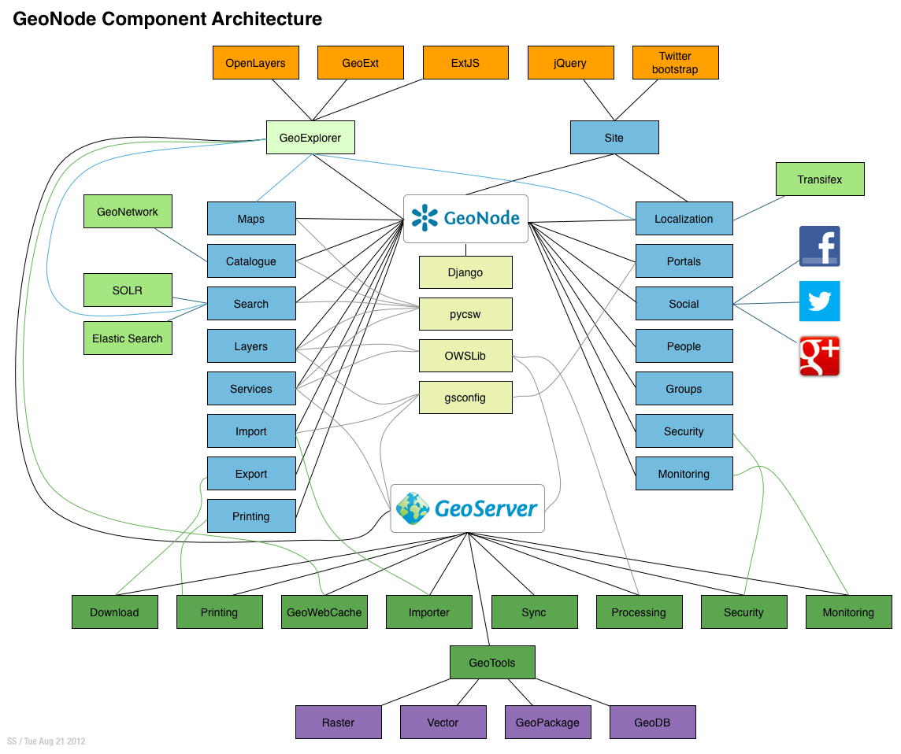

.. _geonode_architecture:

The Big Picture
---------------

Architecture
^^^^^^^^^^^^

*GeoNode Component Architecture*

GeoNode core is based on DJango web framework with few more dependencies necessary for the communication with the geospatial servers (GeoServer, pyCSW)

On the left side you can see the list of *Entities* defined in GeoNode and managed by the DJango ORM framework. Those objects will be detailed in a future section.

On the right side the list of *Services* available allowing GeoNode to communicate with the *social* world.

The GeoNode catalog is strictly connected to the GeoServer one (see the bottom of the figure). The geospatial dataset and the OGC Services are implemented and managed by GeoServer.
GeoNode acts as a broker for the geospatial layers, adding metdata information and tools that make easier the management, cataloging, mapping and searching of the datasets.

Thanks to the ORM framework and the auxiliary Python libraries, GeoNode is constantly aligned with the GeoServer catalog. An ad-hoc security module allows the two modules to strictly
interact and share security and permissions rules.

In the advanced sections of this documentation we will go through GeoNode commands allowing administrators to re-sync the catalogs and keep them consistently aligned.

Django Architecture
^^^^^^^^^^^^^^^^^^^

