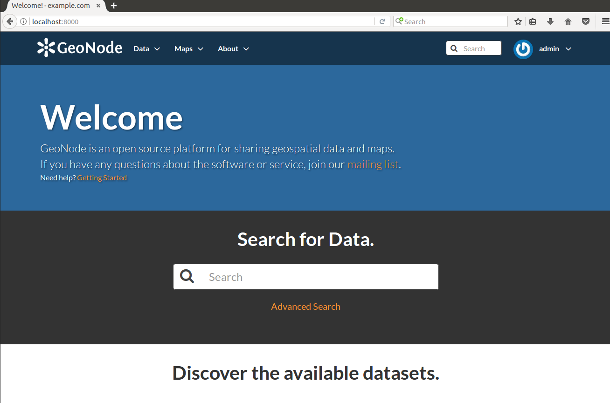

.. _create_geonode_db:

==========================================
Create GeoNode DB & Finalize GeoNode Setup
==========================================

In this section we are going to setup users and databases for GeoNode in PostgreSQL.

.. warning:: Be sure you have successfully completed the steps in the previous section.

Databases and Permissions
=========================
First create the `geonode` user. GeoNode is going to use this user to access the
database

.. code-block:: bash

    $ sudo -u postgres createuser -P geonode

You will be prompted asked to set a password for the user. Enter `geonode` as password

Create `geonode` database with owner `geonode`

.. code-block:: bash

    $ sudo -u postgres createdb -O geonode geonode

And database `geonode_data` with owner `geonode`

.. code-block:: bash

    $ sudo -u postgres createdb -O geonode geonode_data

Switch to user `postgres` and create PostGIS extension

.. code-block:: bash

    $ sudo su postgres
    $ psql -d geonode_data -c 'CREATE EXTENSION postgis;'

Then adjust permissions

.. code-block:: bash

    $ psql -d geonode_data -c 'GRANT ALL ON geometry_columns TO PUBLIC;'
    $ psql -d geonode_data -c 'GRANT ALL ON spatial_ref_sys TO PUBLIC;'

And switch back to the 'geo' user

.. code-block:: bash

    $ exit

Now we are going to change user access policy for local connections in file `pg_hba.conf`

.. code-block:: bash

    $ sudo vim /etc/postgresql/9.5/main/pg_hba.conf

Scroll down to the bottom of the document. We only need to edit one line. Change

.. code-block:: bash

    # "local" is for Unix domain socket connections only
    local   all             all                                     peer

Into

.. code-block:: bash

    # "local" is for Unix domain socket connections only
    local   all             all                                     trust

.. note::

    If your PostgreSQL database resides on a separate machine, you have to allow
    remote access to the databases in the pg_hba.conf for the `geonode` user and
    tell PostgreSQL to accept non local connections in your `postgresql.conf` file

Then restart `PostgreSQL` to make the change effective

.. code-block:: bash

    $ sudo service postgresql restart

PostgreSQL is now ready. To test the configuration try to connect to the `geonode`
database as `geonode`

.. code-block:: bash

    $ psql -U geonode geonode

Finalize GeoNode Setup
======================
Once the DB has been correctly configured, we can finalize the `GeoNode` setup.

**If not already active** let's activate the new `geonode` Python Virtual Environment:

.. code-block:: bash
    
    $ workon geonode

Move into the `geonode` home folder

.. code-block:: bash

    $ cd /home/geonode

Move into the ``my_geonode`` custom project base folder

.. code-block:: bash

    $ cd my_geonode

First of all we need to tweak a bit the `my_geonode` ``local_settings``.
In order to do that, edit the ``my_geonode/local_settings.py`` file:

    .. code-block:: bash

        $ vim my_geonode/local_settings.py
    
    Add the following section at the **end** of file
    
    .. code-block:: python
    
        ...
        # ########################################################################## #
        ALLOWED_HOSTS = ['127.0.0.1', 'localhost', '::1']
        PROXY_ALLOWED_HOSTS = ("127.0.0.1", 'localhost', '::1')

        POSTGIS_VERSION = (2, 0, 7)

        DATABASES = {
            'default': {
                 'ENGINE': 'django.db.backends.postgresql_psycopg2',
                 'NAME': 'geonode',
                 'USER': 'geonode',
                 'PASSWORD': 'geonode',
             },
            # vector datastore for uploads
            'datastore' : {
                'ENGINE': 'django.contrib.gis.db.backends.postgis',
                'NAME': 'geonode_data',
                'USER' : 'geonode',
                'PASSWORD' : 'geonode',
                'HOST' : 'localhost',
                'PORT' : '5432',
            }
        }

        GEOSERVER_LOCATION = os.getenv(
            'GEOSERVER_LOCATION', 'http://localhost:8080/geoserver/'
        )

        GEOSERVER_PUBLIC_LOCATION = os.getenv(
        #    'GEOSERVER_PUBLIC_LOCATION', '{}/geoserver/'.format(SITEURL)
            'GEOSERVER_LOCATION', 'http://localhost:8080/geoserver/'
        )

        OGC_SERVER_DEFAULT_USER = os.getenv(
            'GEOSERVER_ADMIN_USER', 'admin'
        )

        OGC_SERVER_DEFAULT_PASSWORD = os.getenv(
            'GEOSERVER_ADMIN_PASSWORD', 'geoserver'
        )

        # OGC (WMS/WFS/WCS) Server Settings
        OGC_SERVER = {
            'default': {
                'BACKEND': 'geonode.geoserver',
                'LOCATION': GEOSERVER_LOCATION,
                'LOGIN_ENDPOINT': 'j_spring_oauth2_geonode_login',
                'LOGOUT_ENDPOINT': 'j_spring_oauth2_geonode_logout',
                # PUBLIC_LOCATION needs to be kept like this because in dev mode
                # the proxy won't work and the integration tests will fail
                # the entire block has to be overridden in the local_settings
                'PUBLIC_LOCATION': GEOSERVER_PUBLIC_LOCATION,
                'USER' : OGC_SERVER_DEFAULT_USER,
                'PASSWORD' : OGC_SERVER_DEFAULT_PASSWORD,
                'MAPFISH_PRINT_ENABLED' : True,
                'PRINT_NG_ENABLED' : True,
                'GEONODE_SECURITY_ENABLED' : True,
                'GEOGIG_ENABLED' : False,
                'WMST_ENABLED' : False,
                'BACKEND_WRITE_ENABLED': True,
                'WPS_ENABLED' : False,
                'LOG_FILE': '%s/geoserver/data/logs/geoserver.log' % os.path.abspath(os.path.join(PROJECT_ROOT, os.pardir)),
                # Set to dictionary identifier of database containing spatial data in DATABASES dictionary to enable
                'DATASTORE': 'datastore',
            }
        }

        ALT_OSM_BASEMAPS = os.environ.get('ALT_OSM_BASEMAPS', False)
        CARTODB_BASEMAPS = os.environ.get('CARTODB_BASEMAPS', False)
        STAMEN_BASEMAPS = os.environ.get('STAMEN_BASEMAPS', False)
        THUNDERFOREST_BASEMAPS = os.environ.get('THUNDERFOREST_BASEMAPS', False)
        MAPBOX_ACCESS_TOKEN = os.environ.get('MAPBOX_ACCESS_TOKEN', None)
        BING_API_KEY = os.environ.get('BING_API_KEY', None)

        MAP_BASELAYERS = [{
            "source": {"ptype": "gxp_olsource"},
            "type": "OpenLayers.Layer",
            "args": ["No background"],
            "name": "background",
            "visibility": False,
            "fixed": True,
            "group":"background"
        },
        # {
        #     "source": {"ptype": "gxp_olsource"},
        #     "type": "OpenLayers.Layer.XYZ",
        #     "title": "TEST TILE",
        #     "args": ["TEST_TILE", "http://test_tiles/tiles/${z}/${x}/${y}.png"],
        #     "name": "background",
        #     "attribution": "&copy; TEST TILE",
        #     "visibility": False,
        #     "fixed": True,
        #     "group":"background"
        # },
        {
            "source": {"ptype": "gxp_osmsource"},
            "type": "OpenLayers.Layer.OSM",
            "name": "mapnik",
            "visibility": True,
            "fixed": True,
            "group": "background"
        }]

        LOCAL_GEOSERVER = {
            "source": {
                "ptype": "gxp_wmscsource",
                "url": OGC_SERVER['default']['PUBLIC_LOCATION'] + "wms",
                "restUrl": "/gs/rest"
            }
        }
        baselayers = MAP_BASELAYERS
        MAP_BASELAYERS = [LOCAL_GEOSERVER]
        MAP_BASELAYERS.extend(baselayers)

        LOGGING = {
            'version': 1,
            'disable_existing_loggers': True,
            'formatters': {
                'verbose': {
                    'format': '%(levelname)s %(asctime)s %(module)s %(process)d '
                              '%(thread)d %(message)s'
                },
                'simple': {
                    'format': '%(message)s',
                },
            },
            'filters': {
                'require_debug_false': {
                    '()': 'django.utils.log.RequireDebugFalse'
                }
            },
            'handlers': {
                'null': {
                    'level': 'ERROR',
                    'class': 'django.utils.log.NullHandler',
                },
                'console': {
                    'level': 'DEBUG',
                    'class': 'logging.StreamHandler',
                    'formatter': 'simple'
                },
                'mail_admins': {
                    'level': 'ERROR', 'filters': ['require_debug_false'],
                    'class': 'django.utils.log.AdminEmailHandler',
                }
            },
            "loggers": {
                "django": {
                    "handlers": ["console"], "level": "ERROR", },
                "geonode": {
                    "handlers": ["console"], "level": "DEBUG", },
                "gsconfig.catalog": {
                    "handlers": ["console"], "level": "DEBUG", },
                "owslib": {
                    "handlers": ["console"], "level": "DEBUG", },
                "pycsw": {
                    "handlers": ["console"], "level": "ERROR", },
                },
            }
        # ########################################################################## #
        
Finalize GeoNode Setup & Test
^^^^^^^^^^^^^^^^^^^^^^^^^^^^^
The following Python commands will finalize the setup, configure and create DB tables and download GeoServer.

.. warning::
    Before running the next commands be sure that:
    
    * You have completed all the steps from the beginning of this chapter
    
    * You are located into the ``my_geonode`` custom project base folder
    
    * The `geonode` Python Virtual Environment is enabled

Stop all the services

.. code-block:: bash

    $ sudo service apache2 stop
    $ sudo service tomcat8 stop
    # Being sure other services are stopped

Cleanup old stuff

* Hard Reset

    .. warning:: This will delete all data you created until now.

    .. code-block:: bash

        $ paver reset_hard
        # Cleanup folders and old DB Tables

* Hard Reset

    .. note:: This will restore only GeoServer.

    .. code-block:: bash

        $ rm -Rf geoserver
        $ rm -Rf downloaded/*.*

Revert to default site settings

    You need to revert some customizations of the `my_geonode` ``local_settings``.
    In order to do that, edit the ``my_geonode/local_settings.py`` file:

        .. code-block:: bash

            $ vim my_geonode/local_settings.py
        
        Comment the following pieces
        
        .. code-block:: python

            ...
            # SITEURL = 'http://localhost'
            ...
            #GEOSERVER_LOCATION = os.getenv(
            #    'GEOSERVER_LOCATION', '{}/geoserver/'.format(SITEURL)
            #)

            #GEOSERVER_PUBLIC_LOCATION = os.getenv(
            #    'GEOSERVER_PUBLIC_LOCATION', '{}/geoserver/'.format(SITEURL)
            #)
            ...

Being sure folders permissions are correctly set

.. code-block:: bash

    $ sudo chown -Rf geonode: my_geonode/uploaded/
    $ sudo chown -Rf geonode: my_geonode/static*

Setup and start the system in DEV mode

.. code-block:: bash

    $ paver setup
    # This command downloads and extract the correct GeoServer version
    
    $ paver sync
    # This command prepares the DB tables and loads initial data
    
    $ paver start
    # This command allows you to start GeoNode in development mode
    
GeoNode and GeoServer in Development mode
^^^^^^^^^^^^^^^^^^^^^^^^^^^^^^^^^^^^^^^^^
The ``paver start`` command allows you to start the server in **development (DEV)** mode.
That means that you will be able to directly do changes to your code and see the results on the browser.

You need to be careful to the different ``ports`` of the services. In *DEV* mode the services will run on:

* *GeoNode* port ``8000`` -> ``http://localhost:8000/``

* *GeoServer* port ``8080`` -> ``http://localhost:8080/geoserver``

In order to test it, move to ``http://localhost:8000/``

