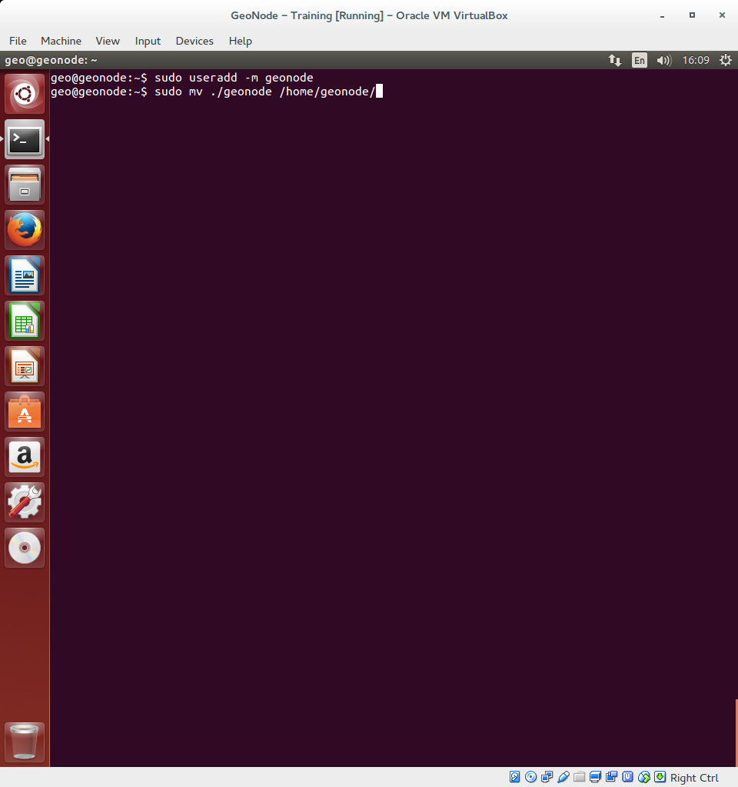

.. _create_geonode_db:

=================
Create GeoNode DB
=================

In this section we are going to setup users and databases for GeoNode in PostgreSQL.

First create the `geonode` user. GeoNode is going to use this user to access the
database::

    sudo -u postgres createuser -P geonode

You will be prompted asked to set a password for the user. Enter `geonode` as password

Create `geonode` database with owner `geonode`::

    sudo -u postgres createdb -O geonode geonode

And database `geonode_data` with owner `geonode`::

    sudo -u postgres createdb -O geonode geonode_data

Switch to user `postgres` and create PostGIS extension::

    sudo su postgres
    psql -d geonode_data -c 'CREATE EXTENSION postgis;'

Then adjust permissions::

    psql -d geonode_data -c 'GRANT ALL ON geometry_columns TO PUBLIC;'
    psql -d geonode_data -c 'GRANT ALL ON spatial_ref_sys TO PUBLIC;'

And switch back to the 'geo' user::

    exit

Now we are going to change user access policy for local connections in file `pg_hba.conf`::

    sudo gedit /etc/postgresql/9.3/main/pg_hba.conf

Scroll down to the bottom of the document. We only need to change one line. Change
::
    # "local" is for Unix domain socket connections only
    local   all             all                                     peer

Into:
::
    # "local" is for Unix domain socket connections only
    local   all             all                                     trust

