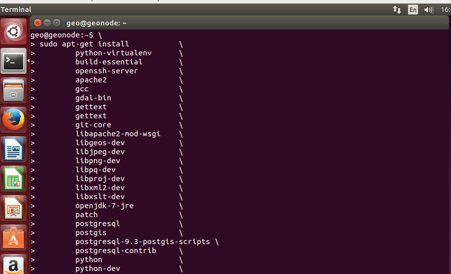

.. _install_geonode_application:

===========================
Install GeoNode Application
===========================

This section describes the setup of a custom GeoNode installation.

Login
=====

When you first start the Virtual Machine at the end of the boot process
you will be prompted for the user password to login. Enter `geo` as user
password and press `Enter`.

You are now logged in as user 'geo'. On the left side of the screen there
is a panel with shortcuts to common applications, launch a the terminal
emulator.

Packages Installation
=====================

First we are going to install all the software packages we are going to need
for the GeoNode setup. Among others `Tomcat 7`, `PostgreSQL`, `PostGIS`,
`Apache HTTP server` and `Git`. Run the following command to install all the
packages::

    sudo apt-get install       \
        python-virtualenv      \
        build-essential        \
        openssh-server         \
        apache2                \
        gcc                    \
        gdal-bin               \
        gettext                \
        git-core               \
        libapache2-mod-wsgi    \
        libgeos-dev            \
        libjpeg-dev            \
        libpng-dev             \
        libpq-dev              \
        libproj-dev            \
        libxml2-dev            \
        libxslt-dev            \
        openjdk-7-jre          \
        patch                  \
        postgresql             \
        postgis                \
        postgresql-9.3-postgis-scripts \
        postgresql-contrib     \
        python                 \
        python-dev             \
        python-gdal            \
        python-imaging         \
        python-pastescript     \
        python-psycopg2        \
        python-support         \
        python-urlgrabber      \
        python-virtualenv      \
        tomcat7                \
        unzip                  \
        zip

You will be prompted for confirmation twice

The installation process is going to take a few minutes.

At this point we have all the packages we need on the system.

GeoNode Setup
=============

Let's download GeoNode from the main GeoNode repository on GitHub:

.. note::
    For the purpose of this training the GeoNode repository repository has
    been downloaded and placed in the `geo` user `home folder` (/home/geo/geonode).
    *Skip* the following command.

::

    git clone https://github.com/GeoNode/geonode.git

Now create the 'geonode' user and move the cloned folder in the user's home folder::

    sudo useradd -m geonode
    sudo mv ~/geonode /home/geonode/

Move into the project folder and install GeoNode::

    cd /home/geonode/geonode
    sudo pip install -e .

We are almost done. The following command will download a GeoServer web archive
that we are going to use in GeoServer setup:

.. note::
    Again, for the purpose of this training the GeoServer web archive has been
    downloaded and placed in the `geo` user `home folder` (/home/geo/geoserver.war).
    *Skip* the following command.

::

        sudo paver setup

In the next section we are going to setup PostgreSQL Databases for GeoNode
