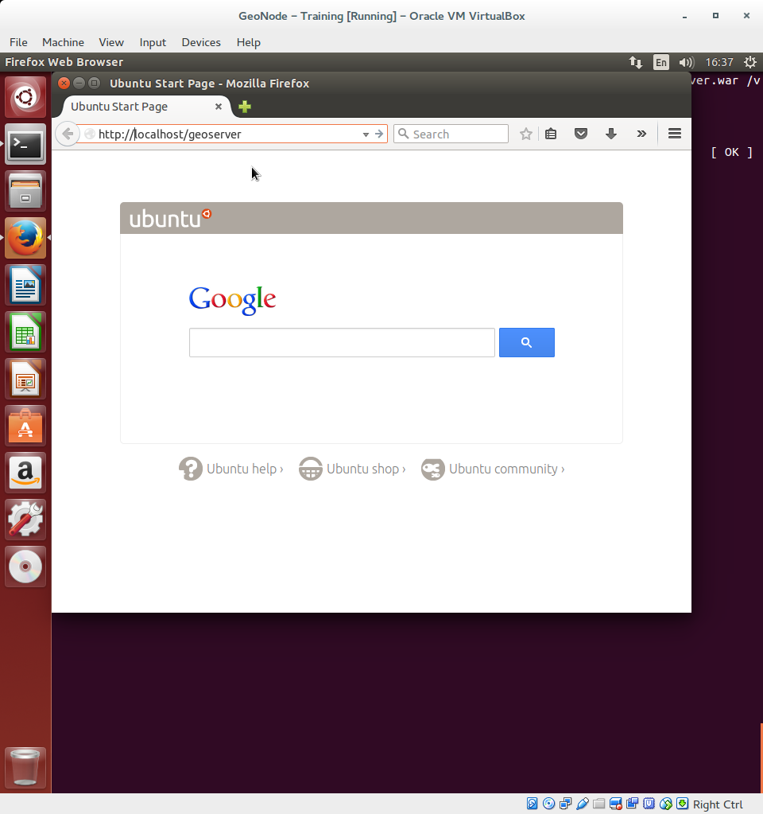
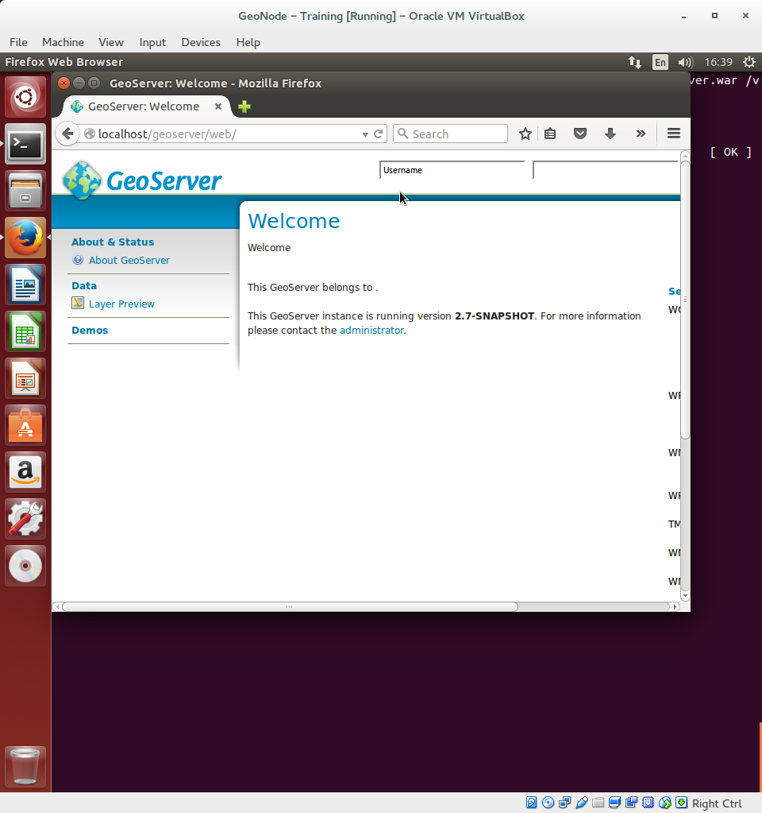

.. _install_geoserver_application:

=============================
Install GeoServer Application
=============================

In this section we are going to setup GeoServer for GeoNode. GeoServer will run inside
`Tomcat` sevrlet container.

Setup GeoServer
===============

You' ve already installed `Tomcat 7` in the system in the first section of the training.
Before you deploy GeoServer stop the running Tomcat instance:
::
    service tomcat7 stop

Now copy the downloaded GeoServer archive inside Tomcat's webapps folder:

.. note::
    As said previously in the training VM the actual path of GeoServer web archive is
    /home/geo/geoserver.war. If you are following the training you sould run this command::

        sudo cp /home/geo/geoserver.war /var/lib/tomcat7/webapps/
    instead

::

    sudo cp /home/geonode/geonode/downloaded/geoserver.war /var/lib/tomcat7/webapps/

Now start Tomcat to deploy GeoServer
::
    service tomcat7 start

Tomcat will extract GeoServer web archive and start GeoServer. This may take awhile

Open a web browser (in this example `Firefox`) and browse http://localhost:8080/geoserver

In a few seconds GeoServer web interface will show up:

