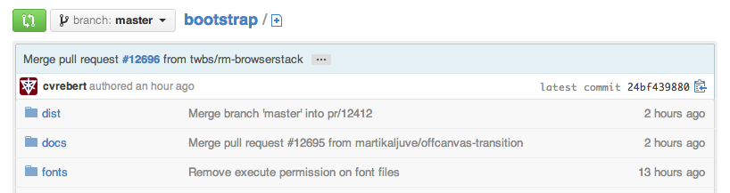
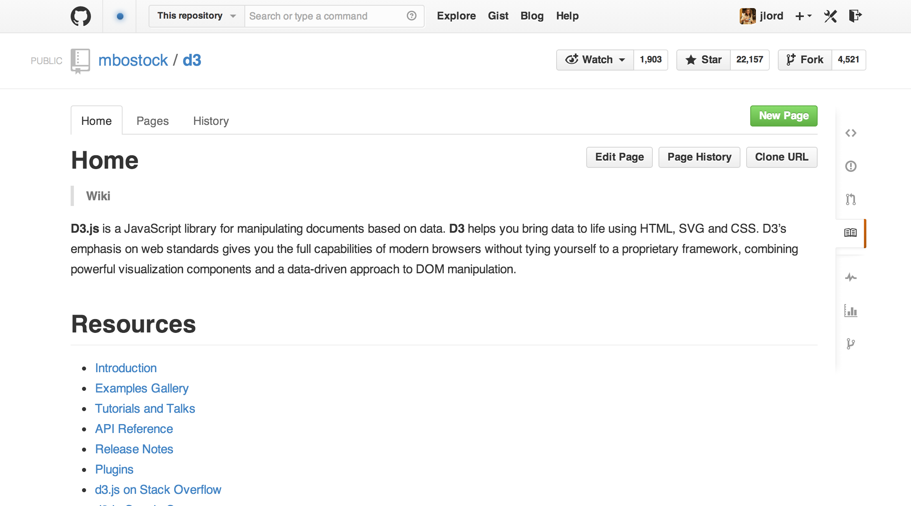
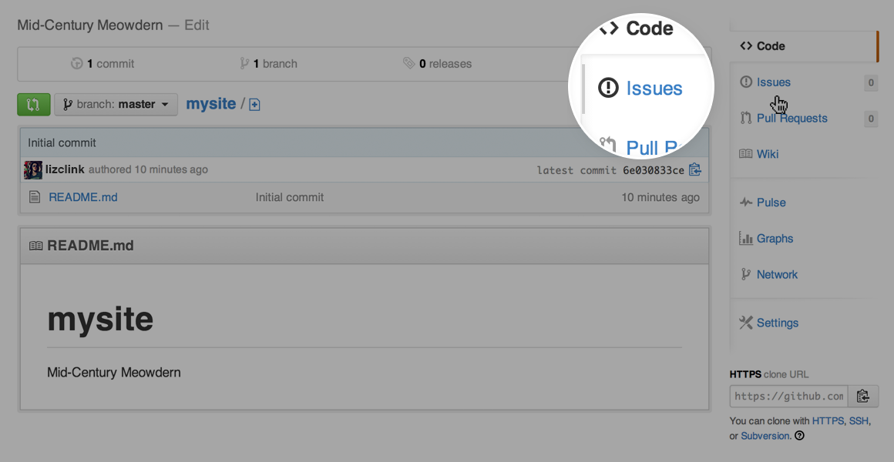
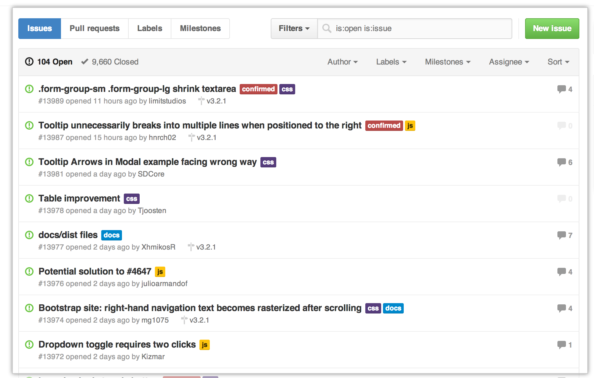
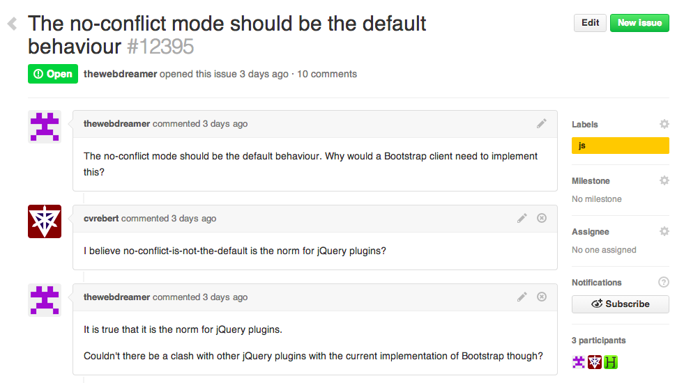
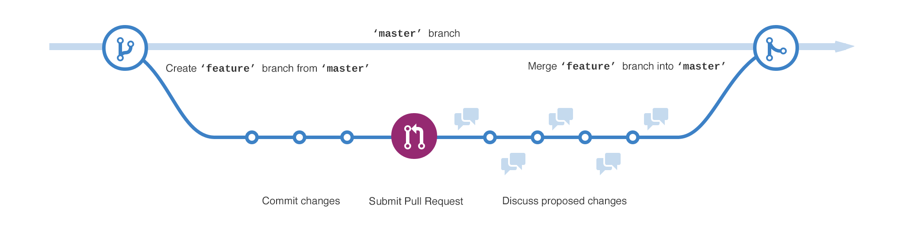
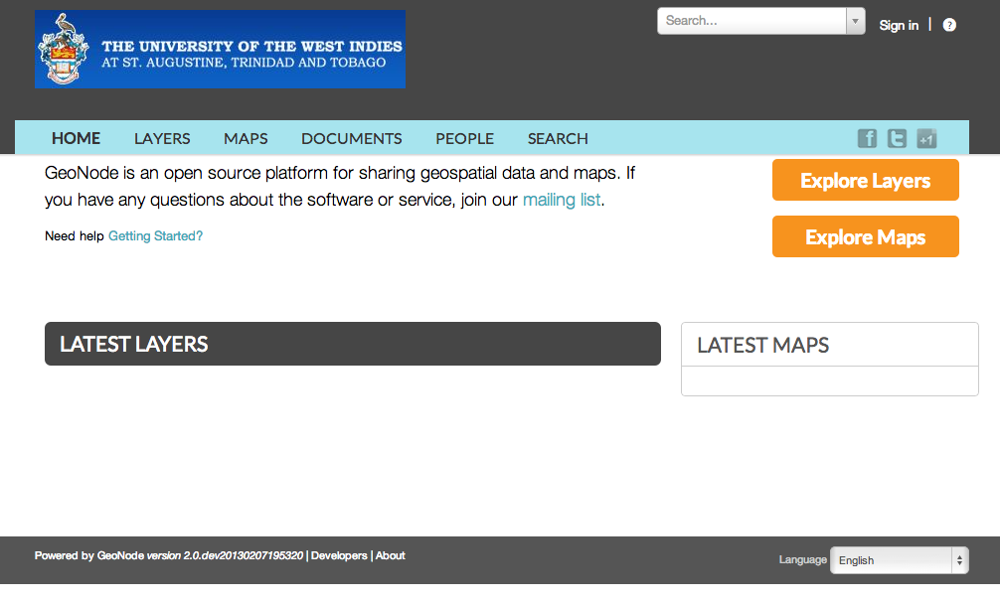

.. _geonode_customize_and_github_workshop:

======================================================
GeoNode Customization and Source Code Revision Control
======================================================

This tutorial collects in a single place the steps for the customization of GeoNode (how to create a custom branch of the project and modify only the parts of intereset) and how to save back the work on a Source Code Revision Control system, like GitHub, and manage the team development process.

GeoNode Customization Setup Steps
=================================

.. warning:: These instructions are only valid if you've installed GeoNode following the guide at :ref:`setup_configure_httpd` !!

If you are working remotely, you should first connect to the machine that has your GeoNode installation. You will need to perform the following steps in a directory where you intend to keep your newly created project.

.. code-block:: console
    :linenos:
	
    $ sudo su
    $ cd /home/geonode
    $ disable_local_repo.sh 
    $ apt-get install python-django
    $ django-admin startproject geonode_custom --template=https://github.com/GeoNode/geonode-project/archive/master.zip -epy,rst
    $ chown -Rf geonode: geonode_custom
    $ exit
    $ sudo pip install -e geonode_custom

.. note:: You should NOT use the name *geonode* for your project as it will conflict with your default geonode package name.

These commands create a new template based on the geonode example project.

Make sure that the directories are reachable and have the correct rights for the users **geonode** and **www-data**:

.. code-block:: console
    :linenos:
	
    $ sudo chown -Rf geonode: *
    $ sudo chmod -Rf 775 geonode_custom

If you have a brand new installation of GeoNode, rename the **/home/geonode/geonode/local_settings.py.sample** to **local_settings.py** and edit it's content by setting the SITEURL and SITENAME. This file will be your main settings file for your project. It inherits all the settings from the original one plus you can override the ones that you need. 

.. note:: You can also decide to copy the **/home/geonode/geonode/local_settings.py.sample** to **/path/to/geonode_custom/geonode_custom/local_settings.py** in order to keep all the custom settings confined into the new project.

.. warning:: In order for the edits to the local_settings.py file to take effect, you have to restart apache.

Edit the file **/etc/apache2/sites-available/geonode.conf** and change the following directive from::

    WSGIScriptAlias / /home/geonode/geonode/wsgi/geonode.wsgi

to::

    WSGIScriptAlias / /home/geonode/geonode_custom/geonode_custom/wsgi.py
    
.. code-block:: console
    :linenos:
	
    $ sudo vi /etc/apache2/sites-available/geonode.conf
    
	  WSGIScriptAlias / /home/geonode/geonode_custom/geonode_custom/wsgi.py
      
      ...
      
      <Directory "/home/geonode/geonode_custom/geonode_custom/">
      
      ...
      

Edit the file /etc/apache2/sites-available/geonode.conf and modify the **DocumentRoot** as follows:

.. note:: It's a good practice to make copies and backups of the configuration files before modifying or updating them in order to revert the configuration at the previous state if something goes wrong.

.. code-block:: html
    :linenos:

    <VirtualHost *:80>
        ServerName http://localhost
        ServerAdmin webmaster@localhost
        DocumentRoot /home/geonode/geonode_custom/geonode_custom

        ErrorLog /var/log/apache2/error.log
        LogLevel warn
        CustomLog /var/log/apache2/access.log combined

        WSGIProcessGroup geonode
        WSGIPassAuthorization On
        WSGIScriptAlias / /home/geonode/geonode_custom/geonode_custom/wsgi.py

        <Directory "/home/geonode/geonode_custom/geonode_custom/">
             <Files wsgi.py>
                 Order deny,allow
                 Allow from all
                 Require all granted
             </Files>

            Order allow,deny
            Options Indexes FollowSymLinks
            Allow from all
            IndexOptions FancyIndexing
        </Directory>
        
        ...

Then regenerate the static **JavaScript** and **CSS** files from **/path/to/geonode_custom/** and restart apache

.. code-block:: console
    :linenos:

    $ cd /home/geonode/geonode_custom
    $ python manage.py collectstatic
    $ python manage.py syncdb
    $ /home/geonode/geonode
    $ sudo pip install -e .
    $ sudo service apache2 restart

Source code revision control
============================

It is recommended that you immediately put your new project under source code revision control. The GeoNode development team uses Git and GitHub and recommends that you do the same. If you do not already have a GitHub account, you can easily set one up. A full review of Git and distributed source code revision control systems is beyond the scope of this tutorial, but you may find the `Git Book`_ useful if you are not already familiar with these concepts.

.. _Git Book: http://git-scm.com/book

#. Create a new repository in GitHub. You should use the GitHub user interface to create a new repository for your new project.

   .. figure:: img/github_home.jpg

      *Creating a new GitHub Repository From GitHub's Homepage*

   .. figure:: img/create_repo.jpg

      *Specifying new GitHub Repository Parameters*

   .. figure:: img/new_repo.jpg

      *Your new Empty GitHub Repository*

#. Initialize your own repository in the geonode_custom folder:

   .. code-block:: console
      :linenos:

      $ sudo git init

#. Add the remote repository reference to your local git configuration:

   .. code-block:: console
      :linenos:

      $ sudo git remote add origin <https url of your custom repo>
      
        https://github.com/geosolutions-it/geonode_custom.git

#. Add your project files to the repository:

   .. code-block:: console
      :linenos:

      $ sudo git add .

#. Commit your changes:

   .. code-block:: console
      :linenos:

        # Those two command must be issued ONLY once
      $ sudo git config --global user.email "geo@geo-solutions.it"
      $ sudo git config --global user.name "GeoNode Training"
      
      $ sudo git commit -am "Initial commit"

#. Push to the remote repository:

   .. code-block:: console
      :linenos:

      $ sudo git push origin master

A Typical GitHub Project Structure
==================================

.. warning:: This section is freely adapted from the official `GitHub guides <https://guides.github.com>`_.

A great way to get involved in open source is to contribute to the existing projects you’re using.


The Community
-------------

Projects often have a community around them, made up of other users in different (formal or informal) roles:

* **Owner** is the user or organization that created the project has the project on their account.
* **Maintainers** and Collaborators are the users primarily doing the work on a project and driving the direction. Oftentimes the owner and the maintainer are the same. They have write access to the repository.
* **Contributors** is everyone who has had a pull request merged into a project.
* **Community** Members are the users who often use and care deeply about the project and are active in discussions for features and pull requests.

Readme
------

Nearly all GitHub projects include a README.md file. The readme provides a lay of the land for a project with details on how to use, build and sometimes contribute to a project.

License
-------

A `LICENSE` file, well, is the license for the project. An open source project’s license informs users what they can and can’t do (e.g., use, modify, redistribute), and contributors, what they are allowing others to do.

Documentation and Wikis
-----------------------

Many larger projects go beyond a readme to give instructions for how people can use their project. In such cases you’ll often find a link to another file or a folder named `docs` in the repository.



Alternatively, the repository may instead use the GitHub wiki to break down documentation.


   
Issues
------

Issues are a great way to keep track of tasks, enhancements, and bugs for your projects. They’re kind of like email—except they can be shared and discussed with the rest of your team. Most software projects have a bug tracker of some kind. GitHub’s tracker is called Issues, and has its own section in every repository.



For more information on how Issues work, see the section ":ref:`work_with_github`"

Pull Requests
-------------

If you’re able to patch the bug or add the feature yourself, make a pull request with the code. 
Be sure you’ve read any documents on contributing, understand the license and have signed a CLA if required. 

Once you’ve submitted a pull request the maintainer(s) can compare your branch to the existing one and decide whether or not to incorporate (pull in) your changes.

For more information on how Pull Requests work, see the section ":ref:`work_with_github`"


Work With GitHub Issues and Pull Requests
=========================================

.. warning:: This section is freely adapted from the official `GitHub guides <https://guides.github.com>`_.

Issues
======

An Issue is a note on a repository about something that needs attention. It could be a bug, a feature request, a question or lots of other things. On GitHub you can label, search and assign Issues, making managing an active project easier.

For example, let’s take a look at `Bootstrap’s Issues section <https://github.com/twbs/bootstrap/issues>`_:



GitHub’s issue tracking is special because of our focus on collaboration, references, and excellent text formatting. A typical issue on GitHub looks a bit like this:



* A **title** and **description** describe what the issue is all about.

* Color-coded **labels** help you categorize and filter your issues (just like labels in email).

* A **milestone** acts like a container for issues. This is useful for associating issues with specific features or project phases (e.g. *Weekly Sprint 9/5-9/16 or Shipping 1.0*).

* One **assignee** is responsible for working on the issue at any given time.

* **Comments** allow anyone with access to the repository to provide feedback.

Open an Issue
-------------

1. Click the Issues tab from the sidebar.

    .. figure:: img/navigation-highlight.png
       :align: center
       
2. Click New Issue.
3. Give your Issue a title and description: *Add a new Logo to GeoNode custom*.

    .. figure:: img/issue.png
       :align: center

Click **Submit new Issue** when you’re done. Now this issue has a permanent home (URL) that you can reference even after it is closed.

Issues Pro Tips
---------------

* **Check existing issues** for your issue. Duplicating an issue is slower for both parties so search through open and closed issues to see if what you’re running into has been addressed already.

* **Be clear** about what your problem is: what was the expected outcome, what happened instead? Detail how someone else can recreate the problem.

* **Link to demos** recreating the problem on things like JSFiddle or CodePen.

* **Include system details** like what the browser, library or operating system you’re using and its version.

* **Paste error output** or logs in your issue or in a Gist. If pasting them in the issue, wrap it in three backticks: ``````` so that it renders nicely.

Branching
=========

**Branching** is the way to work on different parts of a repository at one time.

When you create a repository, by default it has one branch with the name ``master``. You could keep working on this branch and have only one, that’s fine. But if you have another feature or idea you want to work on, you can create another branch, starting from ``master``, so that you can leave ``master`` in its working state.

When you create a branch, you’re making a **copy** of the original branch as it was at that point in time (*like a photo snapshot*). If the original branch changes while you’re working on your new branch, no worries, you can always pull in those updates.



At GeoNode developers use branches for keeping bug fixes and feature work separate from ``master`` (**production**) branch. When a feature or fix is ready, the branch is **merged** into master through a **Pull Request**.

To create a new branch
----------------------

* Go to the project folder and create a new branch

   .. code-block:: console

      $ cd /home/geonode/geonode_custom/ 
      $ sudo git branch add_logo
      $ sudo git checkout add_logo

      
   .. figure:: img/checkout.png
      :align: center

* Check that you are working on the correct branch: ``add_logo``.

   .. code-block:: console

      $ cd /home/geonode/geonode_custom/ 
      $ git branch

      
   .. figure:: img/correct_branch.png
      :align: center

* Push the new branch to GitHub.

   .. code-block:: console

      $ cd /home/geonode/geonode_custom/ 
      $ sudo git push origin add_logo

      
   .. figure:: img/push_branch.png
      :align: center

Make a commit
-------------

On GitHub, saved changes are called **commits**.

Each commit has an associated **commit message**, which is a description explaining why a particular change was made. Thanks to these messages, you and others can read through commits and understand what you’ve done and why.

* Add a new logo to your custom GeoNode as described in the section :ref:`theme_admin`

* Stash the new files into the working project using ``git add``

   .. code-block:: console

      $ cd /home/geonode/geonode_custom/
      $ sudo git add geonode_custom/static
      $ git status
      
   .. figure:: img/commit_logo.png
      :align: center

* **Commit** the changes providing a **commit messages** and push them into your branch : ``add_logo``.

   .. code-block:: console

      $ cd /home/geonode/geonode_custom/
      $ sudo git commit -m "Adding a new logo to the custom GeoNode"
      $ sudo git push origin add_logo
      
   .. figure:: img/push_logo.png
      :align: center

Pull Requests
=============

Pull Requests are the heart of collaboration on GitHub. When you make a pull request, you’re proposing your changes and requesting that someone pull in your contribution - aka merge them into their branch. GitHub’s Pull Request feature allows you to compare the content on two branches. The changes, additions and subtractions, are shown in green and red and called diffs (differences).

As soon as you make a change, you can open a Pull Request. People use Pull Requests to start a discussion about commits (code review) even before the code is finished. This way you can get feedback as you go or help when you’re stuck.

By using GitHub’s @mention system in your Pull Request message, you can ask for feedback from specific people or teams.

Create a Pull Request for changes to the Logo
---------------------------------------------

* Click the Pull Request icon on the sidebar, then from the Pull Request page, click the green **New pull request** button.

   .. figure:: img/gh_pullrequest.gif
      :align: center

* Select the branch you made, ``add_logo``, to compare with ``master`` (the original).

   .. figure:: img/gh_pr_select_branch.png
      :align: center

* Look over your changes in the diffs on the Compare page, make sure they’re what you want to submit.

   .. figure:: img/gh_pr_compare.png
      :align: center
      
* When you’re satisfied that these are the changes you want to submit, click the big green Create Pull Request button.

   .. figure:: img/create-pr.png
      :align: center
      
* Give your pull request a title and since it relates directly to an open issue, include “fixes #” and the issue number in the title. Write a brief description of your changes.

   .. figure:: img/pr-form.png
      :align: center

When you’re done with your message, click **Create pull request!**

Merge your Pull Request
-----------------------

It’s time to bring your changes together – merge your ``add_logo`` branch into the ``master`` (the original) branch.

Click the green button to merge the changes into master.
Click Confirm merge.
Go ahead and delete the branch, since its changes have been incorporated, with the Delete branch button in the purple box.

   .. figure:: img/merge-button.png
      :align: center

If you revisit the issue you opened, it’s now closed! Because you included “fixes #1” in your Pull Request title, GitHub took care of closing that issue when the Pull Request was merged!


Customize the Look & Feel
=========================

Now you can edit the templates in **geonode_custom/templates**, the css and images to match your needs and save the changes back to the Source Revision Control.


Theming your GeoNode project
============================

There are a range of options available to you if you want to change the default look and feel of your GeoNode project. Since GeoNode's style is based on `Bootstrap <http://twitter.github.com/bootstrap/>`_ you will be able to make use of all that Bootstrap has to offer in terms of theme customization. You should consult Bootstrap's documentation as your primary guide once you are familiar with how GeoNode implements Bootstrap and how you can override GeoNode's theme and templates in your own project.

Logos and graphics
------------------

GeoNode intentionally does not include a large number of graphics files in its interface. This keeps page loading time to a minimum and makes for a more responsive interface. That said, you are free to customize your GeoNode's interface by simply changing the default logo, or by adding your own images and graphics to deliver a GeoNode experience the way you envision int.

Your GeoNode project has a directory already set up for storing your own images at :file:`<geonode_custom>/static/img`. You should place any image files that you intend to use for your project in this directory.

Let's walk through an example of the steps necessary to change the default logo. 

#. Change to the :file:`img` directory:

   .. code-block:: console

      $ cd /home/geonode/geonode_custom/geonode_custom/static/img

#. If you haven't already, obtain your logo image. The URL below is just an example, so you will need to change this URL to match the location of your file or copy it to this location:

   .. code-block:: console

      $ sudo wget http://www2.sta.uwi.edu/~anikov/UWI-logo.JPG
      $ sudo chown -Rf geonode: .

#. Change to the :file:`css` directory:

   .. code-block:: console

      $ cd /home/geonode/geonode_custom/geonode_custom/static/css

#. Override the CSS that displays the logo by editing :file:`<geonode_custom>/static/css/site_base.css` with your favorite editor and adding the following lines, making sure to update the width, height, and URL to match the specifications of your image.

   .. code-block:: console

      $ sudo vi site_base.css

   .. code-block:: css

      .navbar-brand {
          width: 373px;
          height: 79px;
          background: transparent url("img/UWI-logo.JPG") no-repeat scroll 15px 0px;
      }

#. Restart your GeoNode project and look at the page in your browser:

   .. code-block:: console

      $ cd /home/geonode
      $ sudo rm -Rf geonode/geonode/static_root/*
      $ cd geonode_custom
      $ python manage.py collectstatic
      $ sudo service apache2 restart

.. note:: It is a good practice to cleanup the **static_folder** and the Browser Cache before reloading in order to be sure that the changes have been correctly taken and displayed on the screen.

Visit your site at http://localhost/ or the remote URL for your site.



   *Custom logo*

You can see that the header has been expanded to fit your graphic. In the following sections you will learn how to customize this header to make it look and function the way you want.

.. note:: You should commit these changes to your repository as you progress through this section, and get in the habit of committing early and often so that you and others can track your project on GitHub. Making many atomic commits and staying in sync with a remote repository makes it easier to collaborate with others on your project.

Cascading Style Sheets
----------------------

In the last section you already learned how to override GeoNode's default CSS rules to include your own logo. You are able to customize any aspect of GeoNode's appearance this way. In the last screenshot, you saw that the main area in the homepage is covered up by the expanded header. 

First, we'll walk through the steps necessary to displace it downward so it is no longer hidden, then change the background color of the header to match the color in our logo graphic.

#. Reopen :file:`<geonode_custom>/static/css/site_base.css` in your editor and add the following rule after the one added in the previous step:

   .. code-block:: console

      $ cd /home/geonode/geonode_custom/geonode_custom/static/css
      $ sudo vi site_base.css

   .. code-block:: css

      #wrap {
          margin: 75px 75px;
      }

#. Add a rule to change the background color of the header to match the logo graphic we used:

   .. code-block:: css

      .navbar-inverse {
          background: #0e60c3;
      }

#. Your project CSS file should now look like this:

   .. code-block:: css

      .navbar-brand {
          width: 373px;
          height: 79px;
          background: url(img/UWI-logo.JPG) no-repeat;
      }

      #wrap {
          margin: 75px 75px;
      }

      .navbar-inverse {
          background: #0e60c3;
      }

#. Restart the development server and reload the page:

   .. code-block:: console

      $ python manage.py collectstatic
      $ sudo service apache2 restart

   .. figure:: img/css_overrides.png

      *CSS overrides*

.. note:: You can continue adding rules to this file to override the styles that are in the GeoNode base CSS file which is built from `base.less <https://github.com/GeoNode/geonode/blob/master/geonode/static/geonode/less/base.less>`_. You may find it helpful to use your browser's development tools to inspect elements of your site that you want to override to determine which rules are already applied. See the screenshot below. Another section of this workshop covers this topic in much more detail.

  .. figure:: img/inspect_element.png

     *Screenshot of using Chrome's debugger to inspect the CSS overrides*


Templates and static pages
--------------------------

Now that we have changed the default logo and adjusted our main content area to fit the expanded header, the next step is to update the content of the homepage itself. Your GeoNode project includes two basic templates that you will use to change the content of your pages.

The file :file:`site_base.html` (in :file:`<geonode_custom>/templates/`) is the basic template that all other templates inherit from and you will use it to update things like the header, navbar, site-wide announcement, footer, and also to include your own JavaScript or other static content included in every page in your site. It's worth taking a look at `GeoNode's base file on GitHub <https://github.com/GeoNode/geonode/blob/master/geonode/templates/base.html>`_. You have several blocks available to you to for overriding, but since we will be revisiting this file in future sections of this workshop, let's just look at it for now and leave it unmodified.

Open :file:`<geonode_custom>/templates/site_base.html` in your editor:

   .. code-block:: console

      $ cd /home/geonode/geonode_custom/geonode_custom/templates
      $ sudo vi site_base.html
      
    .. code-block:: html

       
       
           <link href="{{ STATIC_URL }}css/site_base.css" rel="stylesheet"/>
       

You will see that it extends from :file:`base.html`, which is the GeoNode template referenced above and it currently only overrides the ``extra_head`` block to include our project's :file:`site_base.css` which we modified in the previous section. You can see on `line 22 of the GeoNode base.html template <https://github.com/GeoNode/geonode/blob/master/geonode/templates/base.html#L22>`_ that this block is included in an empty state and is set up specifically for you to include extra CSS files as your project is already set up to do.  

Now that we have looked at :file:`site_base.html`, let's actually override a different template.

The file :file:`site_index.html` is the template used to define your GeoNode project's homepage. It extends GeoNode's default :file:`index.html` template and gives you the option to override specific areas of the homepage like the hero area, but also allows you leave area like the "Latest Layers" and "Maps" and the "Contribute" section as they are. You are of course free to override these sections if you choose and this section shows you the steps necessary to do that below.

.. todo:: "hero area"?

#. Open :file:`<geonode_custom>/templates/site_index.html` in your editor.

#. Edit the ``<h1>`` element on line 9 to say something other than "Welcome":

   .. code-block:: html

      <h1></h1>

#. Edit the introductory paragraph to include something specific about your GeoNode project:

   .. code-block:: html

      <p>
          
          UWI's GeoNode is setup for students and faculty to collaboratively
          create and share maps for their class projects. It is maintained by the
          UWI Geographical Society.
          
      </p>

#. Change the :guilabel:`Getting Started` link to point to another website:

   .. code-block:: html

      <span>
          For more information about the UWI Geographical society, 
          <a href="http://uwigsmona.weebly.com/">visit our website</a>
      </span>

#. Add a graphic to the hero area above the paragraph replaced in step 3:

   .. code-block:: html

      

#. Your edited :file:`site_index.html` file should now look like this:

   .. code-block:: html

    
    
    
    This is where you can override the hero area block. You can simply modify the content below or replace it wholesale to meet your own needs. 
    
      
      <div class="jumbotron">
        <div class="container">
            <h1></h1>
            <div class="hero-unit-content"/>
            <div class="intro">
                
            </div>
            <p>
                
                UWI's GeoNode is setup for students and faculty to collaboratively
                create and share maps for their class projects. It is maintained by the
                UWI Geographical Society.
                
            </p>
            <span>
                For more information about the UWI Geographical society,
                <a href="http://uwigsmona.weebly.com/">visit our website</a>
            </span>    
        </div>
      </div>
      

#. Refresh your GeoNode project and view the changes in your browser at http://localhost/ or the remote URL for your site:

   .. code-block:: html

      $ python manage.py collectstatic
      $ sudo service apache2 restart

   .. figure:: img/homepage.png

From here you can continue to customize your :file:`site_index.html` template to suit your needs. This workshop will also cover how you can add new pages to your GeoNode project site.


Other theming options
---------------------

You are able to change any specific piece of your GeoNode project's style by adding CSS rules to :file:`site_base.css`, but since GeoNode is based on Bootstrap, there are many pre-defined themes that you can simply drop into your project to get a whole new look. This is very similar to `WordPress <http://wordpress.com>`_ themes and is a powerful and easy way to change the look of your site without much effort.

Bootswatch
~~~~~~~~~~

`Bootswatch <http://bootswatch.com>`_ is a site where you can download ready-to-use themes for your GeoNode project site. The following steps will show you how to use a theme from Bootswatch in your own GeoNode site.

#. Visit http://bootswatch.com and select a theme (we will use Sandstone for this example). Select the :guilabel:`download bootstrap.css option` in the menu:

   .. figure:: img/bootswatch.png

#. Put this file into :file:`<geonode_custom>/static/css`.

   .. code-block:: console

      $ cd /home/geonode/geonode_custom/geonode_custom/static/css

#. Update the :file:`site_base.html` template to include this file. It should now look like this:

   .. code-block:: console

      $ cd /home/geonode/geonode_custom/geonode_custom/templates
      $ sudo vi site_base.html

   .. code-block:: html

      
      
          <link href="{{ STATIC_URL }}css/site_base.css" rel="stylesheet"/>
          <link href="{{ STATIC_URL }}css/bootstrap.css" rel="stylesheet"/>
      

#. Refresh the development server and visit your site:

   .. code-block:: html

      $ python manage.py collectstatic
      $ sudo service apache2 restart

   .. figure:: img/bootswatch_geonode.png

Your GeoNode project site is now using the Sandstone theme in addition to the changes you have made.

.. todo:: Squeeze up the header and update this doc!

Final Steps
===========

When you've done the changes, run the following command in the *geonode_custom* folder:

.. code-block:: console
    :linenos:

    $ cd /home/geonode/geonode_custom
    $ python manage.py collectstatic

And now you should see all the changes you've made to your GeoNode.