.. _geonode_data_migration_workshop:

======================================
Migrate Data Between GeoNode Instances
======================================

This workshop shows how to migrate GeoNode Layers (along with GeoServer associated datasets and styles) from an instance to another.

The whole tutorial is divided in different parts, each one showing a different methodology to perform the data migration:

#. Manual migration of data between to GeoNode instances with same version

#. Semi-automatic migration of data between GeoNode instances with same version

#. Automatic migration of data between GeoNode instances with same version

#. Automatic migration of data between GeoNode instances with different version

.. warning:: Currently the points 2,3,4 are not yet feasable with the actual GeoNode version. Those section will be available as soon as the "**GeoNode Backup & Restore**" `GNIP <https://github.com/GeoNode/geonode/issues/2401>`_ development will be ready and merged to the ``master`` branch.

Manual migration of data between GeoNode instances with same version
====================================================================

This section shows how to export a Layer from a GeoNode instance and import it back to another one with the same versions.

Before going through the commands and the operations to perform the export/import tasks, the tutorial will explain in details the structure of a GeoNode Layer.

As you may already know, the physical geospatial data, along with its graphical stylesheets (also known as **SLDs**), are backed by GeoServer.
Each GeoNode version is shipped with a related GeoServer version and GeoServer Data Dir (we will see in details later what does it means).
For the moment the important thing to know is that GeoNode cannot live without a running instance of GeoServer. Therefore migrating data from a GeoNode instance to another one,
means also move geospatial data and stylesheets between the related GeoServer instances.

A GeoNode Layer Structure
-------------------------
Lets start anlysing deeply a GeoNode Layer structure.

Preparation Of The Webinar
^^^^^^^^^^^^^^^^^^^^^^^^^^
This tutorial is generic and can be executed using any existing Layer of GeoNode, however in order to follow exactly the same passages, please execute this first simple exercise.

.. warning:: As a prerequisite, you must have access to a GeoNode instance with Admin rights.

**Exercise**

*Add A Sample Layer To GeoNode*

1. Log into GeoNode as ``Administrator``

2. Click on the ``Add Layers`` button from the home page, in order to switch to the upload page

   .. figure:: img/layer_add_layers_button.jpg

      *GeoNode Add Layers Button*

3. Click on the ``Browse`` on the upload page

   .. figure:: img/layer_upload_browse_button.jpg

      *GeoNode Upload Browse Button*

4. Select from the folder ``gisdata/data/good/vector`` the **4** files

    - san_andres_y_providencia_coastline.dbf

    - san_andres_y_providencia_coastline.prj

    - san_andres_y_providencia_coastline.shp

    - san_andres_y_providencia_coastline.shx

    
   .. figure:: img/layer_upload_coastline.jpg

      *GeoNode Upload Browse Button*

5. Click on the ``Upload Files`` button and make sure the operation completes successfully
  
   .. figure:: img/layer_upload_upload_files.jpg

      *GeoNode Upload Files Button*

Layer Metadata
^^^^^^^^^^^^^^
Each resource in GeoNode has metadata. Metadada in GeoNode is quite important, it is used by the application to describe, search and identify a resource. 
As an instance part the title, abstract, regions or keywords of a resource are all part of the metadata.

Metadata in GeoNode is stored on the backend databse as a set of fields associated to the resource. The catalogue service then, makes use of such information to dynamically generate ISO compliant XML records.
Those records can be used by external catalogiung applications, compliant with the standards supported by GeoNode, in order to automatically recognize and indexing the available resources on the server.

The GeoNode Layer info page makes use of some metadata fields to provide immediate description of the Layer.

As shown in the figure below, the GeoNode ``Info`` tab contains a table reporting basic information about the Layer, like the *Title*, the *Abstract*, the *Category* and others.

   .. figure:: img/layer_metadata_001.jpg

      *GeoNode Layer Info*

.. warning:: The *Title* shown on the Layer Metadata **is not** the real Layer name. We will deepen the topic on the following sections of this tutorial.

In order to obtain the whole Layer Metadata in one standard format (usually not quite human-friendly; a huge and long XML), it is possible to click on the ``Download Metadada`` button on the right panel.
GeoNode will present to the user a modal window with a list of permalinks to the dynamic XML supported formats.

   .. figure:: img/layer_metadata_002.jpg

      *GeoNode Layer Download Metadada*

As an instance, if you click on ``ISO``, you will get an XML containing all the Layer metadata fields in ``ISOTC211/19115`` format.

   .. figure:: img/layer_metadata_003.jpg

      *GeoNode Layer Download Metadada ISOTC211/19115 Format*

**Excercise**

*Edit The Layer Metadada*

1. Go to the ``GeoNode Layer List``

   .. figure:: img/layer_metadata_004.jpg

      *GeoNode Layer List*

2. Click on a ``Layer`` in order to go to the resource info page

   .. figure:: img/layer_metadata_005.jpg

      *GeoNode Layer Edit*

3. Click on the ``Edit Layer`` button

   .. figure:: img/layer_metadata_006.jpg

      *GeoNode Layer Download Metadada Button*

4. Click on the ``Edit`` button under the ``Metadada`` incon of the modal window

   .. figure:: img/layer_styles_002.jpg

      *GeoNode Metadada Edit*

5. Update the at least the ``Title``, the ``Abstract`` and the ``Category`` and finally click on the ``Update`` button

   .. figure:: img/layer_edit_metadata_001.jpg

      *GeoNode Metadada Edit*

**The export** of metadata is a foundamental task to achieve when moving a resource from a GeoNode instance to another.

**Excercise**

*Export the Layer Metadata as ISOTC211/19115 and save it to an XML files on the local storage*

1. Go to the ``GeoNode Layer List``

   .. figure:: img/layer_metadata_004.jpg

      *GeoNode Layer List*

2. Click on a ``Layer`` in order to go to the resource info page

   .. figure:: img/layer_metadata_005.jpg

      *GeoNode Layer Edit*

3. Click on the ``Download Metadada`` button

   .. figure:: img/layer_metadata_006.jpg

      *GeoNode Layer Download Metadada Button*

4. From the modal window, click with the **right mouse button** over the ``ISO`` link

   .. figure:: img/layer_metadata_007.jpg

      *GeoNode Layer Download Metadada ISOTC211/19115 Format*

5. From the context menù, select the voice **Save Link As**

   .. figure:: img/layer_metadata_008.jpg

      *GeoNode Layer Download Metadada ISOTC211/19115 Save Link As*

6. Store the xml into the hard disk and note the location for later use

   .. figure:: img/layer_metadata_009.jpg

      *GeoNode Layer Download Metadada ISOTC211/19115 XML*

Layer Styles
^^^^^^^^^^^^
Each Layer in GeoNode has a representation style associated, or a ``Legend`` if you want.

A style is basically a set of rules instructing the geospatial server on how to create a portrayal of the original data. The figure shown in the map is only one of the inifite possible representation of the data stored on the server.

It is worth to point out that **viewing the data** is substantially different from **getting the data**. A portrayal of data provides to the users an immediate understanding of the meaning (or at least of one possible meaning), but this is not suitable for data analysis or more sophisticated computational tasks.

The legend (or style), depends exclusvely from the geometry of the layer and, optionally, from a subset of its atributes.

On GeoNode, if you move to a Layer info page, you can notice a small ``Legend`` panel on the right representing the style currently in use.

   .. figure:: img/layer_styles_001.jpg

      *GeoNode Layer Download Metadada ISOTC211/19115 XML*

A Layer can have a lot of different styles associated, of course. Usually there is a ``Default Style`` which is the one presented to the users if not differently specified.

It is possible from the GeoNode interface to manage the styles associated to a Layer and also change its ``Default Style``.

.. note:: Only owners or users with write permissions on the Layer can update the styles.

**Excercise**

*Layer Styles Management Panel*

1. Go to the ``GeoNode Layer List``

   .. figure:: img/layer_metadata_004.jpg

      *GeoNode Layer List*

2. Click on a ``Layer`` in order to go to the resource info page

   .. figure:: img/layer_metadata_005.jpg

      *GeoNode Layer Edit*
      
3. Click on the ``Edit Layer`` button on the right panel

   .. figure:: img/layer_edit_button.jpg

      *GeoNode Layer Edit Button*

4. Click on the ``Manage`` button under the ``Styles`` incon of the modal window

   .. figure:: img/layer_styles_002.jpg

      *GeoNode Layer Styles Manage*

5. Play with the styles comboboxex in order to change the ``Default Style`` or add/remove more of them **without** updating the Layer

   .. figure:: img/layer_styles_003.jpg

      *GeoNode Layer Styles Management Panel*

.. warning:: **Do not** click on ``Update Available Styles`` button, otherwise you will change the current Layer styles.

**GeoNode also** provides a simple tool for the editing of the Layer style directly from the web interface.

.. note:: It is worth noting that the GeoNode style editor is very simple and does not allow advanced style editing. Also this tool may not work perfectly with complex layers. Further in the tutorial we will see how it is possible to edit directly the style using the ``SLD`` native format.

**Excercise**

*Update the default style through the GeoNode Style Editor tool*

1. Go to the ``GeoNode Layer List``

   .. figure:: img/layer_metadata_004.jpg

      *GeoNode Layer List*

2. Click on a ``Layer`` in order to go to the resource info page

   .. figure:: img/layer_metadata_005.jpg

      *GeoNode Layer Edit*
      
3. Click on the ``Edit Layer`` button on the right panel

   .. figure:: img/layer_edit_button.jpg

      *GeoNode Layer Edit Button*

4. Click on the ``Edit`` button under the ``Styles`` incon of the modal window

   .. figure:: img/layer_styles_002.jpg

      *GeoNode Layer Styles Edit*

5. You should see a small window similar to the one depicted below

   .. figure:: img/layer_styles_004.jpg

      *GeoNode Layer Styles Editor*

6. Select the first ``Rule`` and click on the small ``Edit`` button below

   .. figure:: img/layer_styles_006.jpg

   .. figure:: img/layer_styles_005.jpg
   
      *GeoNode Layer Styles Edit Rules*

7. Modify the ``Name``, the ``Color`` and the ``Width`` of the stroke and click save

   .. figure:: img/layer_styles_007.jpg

      *GeoNode Layer Styles Edit Stroke*

**The GeoNode style** editor tool just simplifies the editing of a Layer style by providing a small graphic user interface to one of the GeoServer capabilities.

Under the hood a Layer style is a special XML format defined from the Open Geospatial Consortium (OGC) as ``Style Layer Descriptor`` or **SLD**.

Advanced users can directly modify the SLD or use more advanced tools to create very complex and beautiful Layer styles.

In order to do that, you will need to update the SLD source directly through the GeoServer interface.

**Excercise**

*Update the default style through the GeoServer interface*

1. Log inot GeoNode as ``Administrator``. Then click on the user button on the top right.

   .. figure:: img/layer_styles_008.jpg

      *GeoNode Admin*

2. From the menu, click on the ``GeoServer`` voice.

   .. figure:: img/layer_styles_009.jpg

      *GeoNode Admin GeoServer*

3. You will be redirected to the ``GeoServer`` admin interface.

   .. figure:: img/layer_styles_010.jpg

      *GeoServer Admin Gui*

4. Select the ``Styles`` topic from the left menu.

   .. figure:: img/layer_styles_011.jpg

      *GeoServer Admin Styles*

5. Select the layer name from the list and click on it. You will be redirected to the SLD editor page.

   .. figure:: img/layer_styles_012.jpg

      *GeoServer Admin Style Editor*

6. Modify the ``Color`` and the ``Width`` of the ``External Border`` XML rule. Click on ``Preview legend`` to see the changes, and when you are happy ``Submit`` the SLD.

   .. figure:: img/layer_styles_013.jpg

      *GeoServer Admin Style Editor*

7. Go back to GeoNode. Reload the Layer in order to see the changes.

   .. figure:: img/layer_styles_014.jpg

      *GeoNode Updated Layer Style*
      

GeoServer Web Interface Basics
^^^^^^^^^^^^^^^^^^^^^^^^^^^^^^
This section will introduce the basic concepts of the web administration interface (generally abbreviated to "web admin" .)

**Welcome Page**

For most installations, GeoServer will start a web server on localhost at port 8080, accessible at the following URL::

   http://localhost:8080/geoserver/web

.. note:: This URL is dependent on your installation of GeoServer. When using the WAR installation, for example, the URL will be dependent on your container setup. A **GeoNode/GeoServer** production environment, usually maps GeoServer un the same port 80 like the following

          .. code-block:: console
            
            http://<geonode_host>/geoserver/web

When correctly configured, a welcome page will open in your browser.

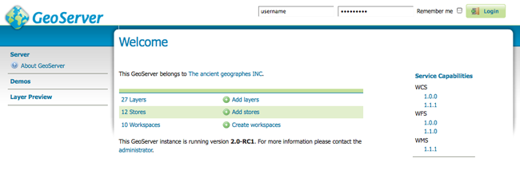
   
   *Welcome Page*
   
The welcome page contains links to various areas of the GeoServer configuration. The :guilabel:`About GeoServer` section in the :guilabel:`Server` menu provides external links to the GeoServer documentation, homepage, and bug tracker. The page also provides login access to the geoserver console. This security measure prevents unauthorized users from making changes to your GeoServer configuration. The default username and password is ``admin`` and ``geoserver``. These can be changed only by editing the :file:`security/users.properties` file in the :ref:`data_directory`. 

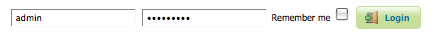
   
   *Login*

Regardless of authorization access, the web admin menu links to the :guilabel:`Demo` and :guilabel:`Layer Preview` portion of the console. The :ref:`webadmin_demos` page contains links to various information pages, while the :ref:`layerpreview` page provides spatial data in various output formats.

.. warning:: On a **GeoNode/GeoServer** environment, you need to login on GeoNode first. The authorization is automatically taken by GeoServer through your browser cookies. 

             Once logged into GeoNode, going to ``http://<geonode_host>/geoserver/web`` will automatically log into GeoServer with the same rights.

.. note:: On a **GeoNode/GeoServer** environment, GeoServer still allows ``FORM`` and ``BASIC`` authentication mechanism (like shown in this section). But this is useful only if you need to access to GeoServer from external applications or with another/specific GeoServer user. You **must** know the username and passowrd of the GeoServer user in this case.

When logged on, additional options will be presented.

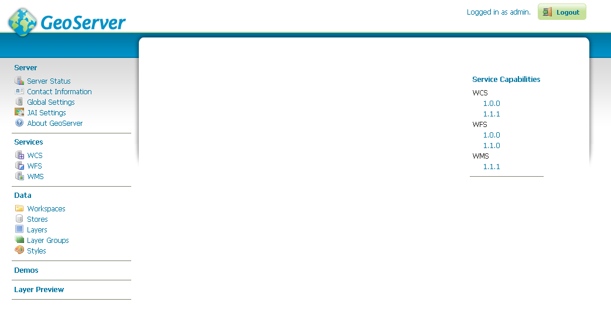
   
   *Additional options when logged in*

Geoserver Web Coverage Service (WCS), Web Feature Service (WFS), and Web Map Service (WMS) configuration specifications can be accessed from this welcome page as well.

.. _webadmin_lists:

**List Pages**

Some web admin pages show list views of configuration data type items available in the GeoServer instance.
The page displays links to the items, and where applicable their parent items as well.
To facilitate working with large sets of items, list views allow sorting and searching across all items in the data type.

In the example below, the GeoServer Layers page displays a list of layers along with links to their parent GeoServer Stores and GeoServer Workspaces. 

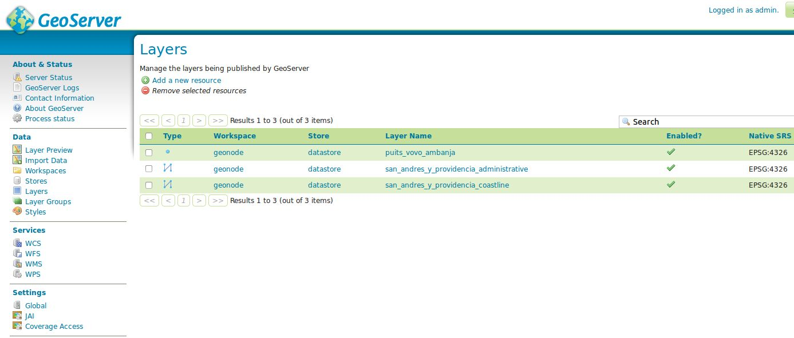

   *Layers list page*

**Sorting**

To sort a column alphabetically, click the column header. 

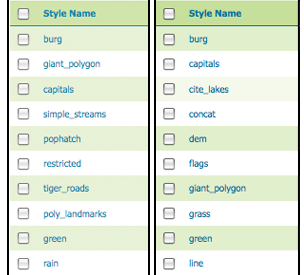

   *Unsorted (left) and sorted (right) columns*

**Searching**

Searching can be used to filter the number of items displayed.  This is useful for working with data types that contain a large number of items.

To search data type items, enter the search string in the search box and click Enter. GeoServer will search the data type for items that match your query, and display a list view showing the search results.

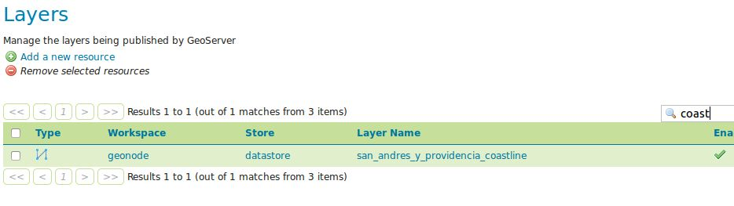
   
   *Search results for the query "coast" on the Layers page*

GeoServer Workspaces
^^^^^^^^^^^^^^^^^^^^
This section describes how to view and configure workspaces. Analogous to a namespace, a workspace is a container which organizes other items. In GeoServer, a workspace is often used to group similar layers together. Layers may be referred to by their workspace name, colon, layer name (for example ``geonode:san_andres_y_providencia_coastline``). Two different layers can have the same name as long as they belong to different workspaces (for example ``sf:states`` and ``topp:states``).

.. note:: On a **GeoNode/GeoServer** environment, by default there is **only one** workspace defined called **geonode**. You can still define other workspaces, but GeoNode will work only with Layers under the **geonode** workspace.

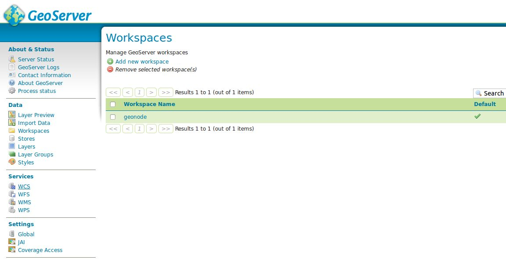
   
   *Workspaces page*

**Edit a Workspace**

To view or edit a workspace, click the workspace name. A workspace configuration page will be displayed.

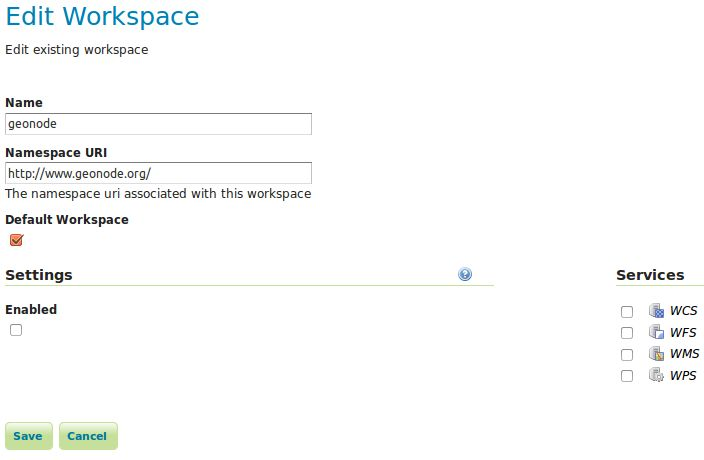
   
   *Workspace named "geonode"*
   
A workspace is defined by a name and a Namespace URI (Uniform Resource Identifier). The workspace name is limited to ten characters and may not contain space. A URI is similar to a URL, except URIs do not need to point to a actual location on the web, and only need to be a unique identifier. For a Workspace URI, we recommend using a URL associated with your project, with perhaps a different trailing identifier. For example, ``http://www.geonode.org/`` is the URI for the "geonode" workspace,  ``http://www.openplans.org/topp`` is the URI for the "topp" workspace. 

**Add a Workspace**

The buttons for adding and removing a workspace can be found at the top of the Workspaces view page. 

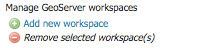
   
   *Buttons to add and remove*
   
To add a workspace, select the :guilabel:`Add new workspace` button. You will be prompted to enter the the workspace name and URI.  
   
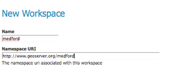
   
   *New Workspace page with example*

**Remove a Workspace**

To remove a workspace, select it by clicking the checkbox next to the workspace. Multiple workspaces can be selected, or all can be selected by clicking the checkbox in the header.  Click the :guilabel:`Remove selected workspaces(s)` button. You will be asked to confirm or cancel the removal. Clicking :guilabel:`OK` removes the selected workspace(s). 

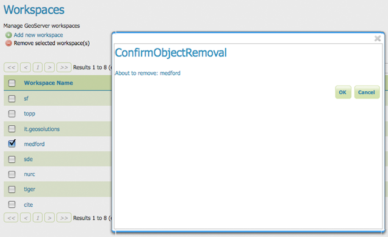
   
   *Workspace removal confirmation*

.. warning:: Removing a **workspace** will delete also all the **layers** associated with it.

**Workspaces On The GeoServer Data Dir**

All the configuration files of a **workspace** are stored into the GeoServer Data Dir. We will see later, on another section of the tutorial, how to access this folder.

It is worth noting that there is also a **physical** dependency between **workspaces**, **stores** and **layers**.

A GeoServer **layer** is always defined by its **workspace** and **store**.
In the GeoServer Data Dir the **layer** definition is stored as a subdirectory of its **store**, the **store** definition is stored as a subdirectory of its **workspace**.

   .. code-block:: console
      :linenos:
      
       <data_directory>/

          ...
          
          workspaces/
            |
            +- workspace dirs...
               |
               +- datastore dirs...
                  |
                  +- layer dirs...

GeoServer Stores
^^^^^^^^^^^^^^^^
A store connects to a data source that contains raster or vector data. 
A data source can be a file or group of files, a table in a database, a single raster file, or a directory (for example, a Vector Product Format library). 
The store construct allows connection parameters to be defined once, rather than for each dataset in a source. 
As such, it is necessary to register a store before configuring datasets within it.

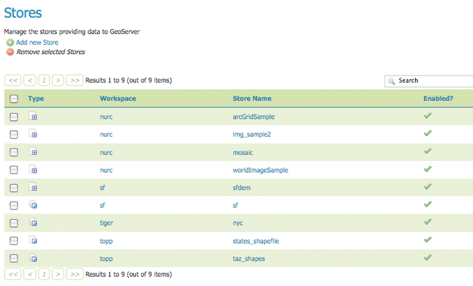
   
   *Stores View*

**Store types**

While there are many potential formats for data sources, there are only four kinds of stores. 
For raster data, a store can be a file. For vector data, a store can be a file, database, or server. 

.. list-table::
   :widths: 15 85 

   * - **Type Icon**
     - **Description**
   * - .. image:: img/data_stores_type1.png
     - raster data in a file
   * - .. image:: img/data_stores_type3.png
     - vector data in a file
   * - .. image:: img/data_stores_type2.png
     - vector data in a database 
   * - .. image:: img/data_stores_type5.png
     - vector server (web feature server)
     

**Edit a Store**

To view or edit a store, click the store name. A store configuration page will be displayed.  
The exact contents of this page depend on the specific format of the store. 
See the sections `Working with Vector Data <http://docs.geoserver.org/stable/en/user/data/vector/index.html#data-vector>`_, `Working with Raster Data <http://docs.geoserver.org/stable/en/user/data/raster/index.html#data-raster>`_, and `Working with Databases <http://docs.geoserver.org/stable/en/user/data/database/index.html#data-database>`_ for information about specific data formats. 
The example shows the configuration for the ``nurc:ArcGridSample`` store.

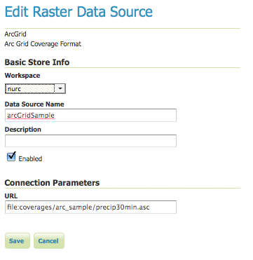
   
   *Editing a raster data store*

**Basic Store Info**

The basic information is common for all formats. 

* **Workspace** - the store is assigned to the selected workspace
* **Data Source Name** - the store name as listed on the view page
* **Description** - (optional) a description that displays in the administration interface
* **Enabled** - enables or disables access to the store, along with all datasets defined for it

**Connection Parameters**

The connection parameters vary depending on data format.

**Add a Store**

The buttons for adding and removing a store can be found at the top of the Stores page. 

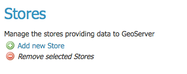
   
   *Buttons to add and remove a Store*

To add a store, select the :guilabel:`Add new Store` button. You will be prompted to choose a data source. GeoServer natively supports many formats (with more available via extensions). Click the appropriate data source to continue. 

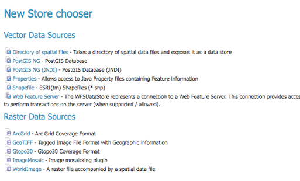
   
   *Choosing the data source for a new store*

The next page configures the store. Since connection parameters differ across data sources, the exact contents of this page depend on the store's specific format. See the sections :ref:`data_vector`, :ref:`data_raster`, and :ref:`data_database` for information on specific data formats.
The example below shows the ArcGrid raster configuration page.

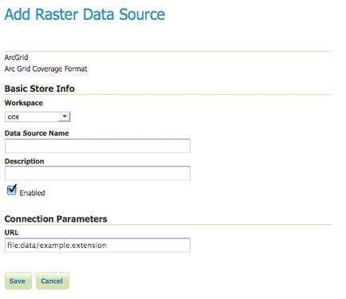
   
   *Configuration page for an ArcGrid raster data source*

**Remove a Store**
   
To remove a store, click the checkbox next to the store. Multiple stores can be selected, or all can be selected by clicking the checkbox in the header.  

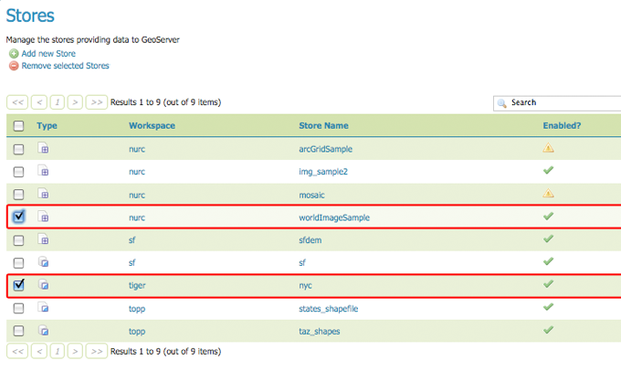
   
   *Stores selected for removal*

Click the :guilabel:`Remove selected Stores` button. You will be asked to confirm the removal of the configuration for the store(s) and all resources defined under them. Clicking :guilabel:`OK` removes the selected store(s), and returns to the Stores page.

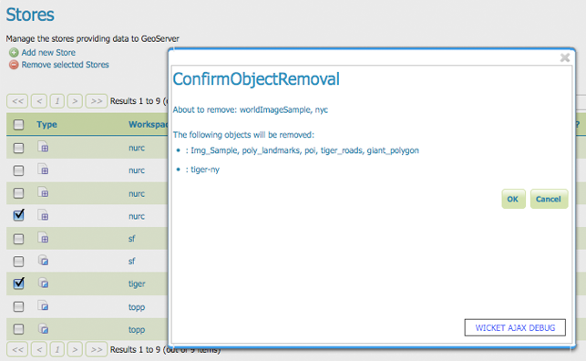

   *Confirm removal of stores*

How GeoNode Automatically Configures Workspaces And Stores
^^^^^^^^^^^^^^^^^^^^^^^^^^^^^^^^^^^^^^^^^^^^^^^^^^^^^^^^^^

**GeoNode currently** creates the **Stores** automatically on **Layer** upload.

Summarizing GeoNode does:

- **GeoNode** uses always the **Workspace** **geonode** for each **Layer**

- **GeoNode** configures automatically the **Stores** for the **Layers**

    - For **Raster** **Layers**; GeoNode creates a **Store** of type **GeoTIFF** with the same name of the **Layer**
    
    - For **Vectorial** **Layers**; GeoNode creates a **Store** of type **ESRI Shapefile** with the same name of the **Layer** only if not connected to a Database
    
    - For **Vectorial** **Layers**; GeoNode uses always the same **Store** of type **Postgis** and convert the vectorial data into Database Tables

**Excercise**

*GeoNode Workspace And Stores*

1. Log inot GeoNode as ``Administrator``. Then click on the user button on the top right.

   .. figure:: img/layer_styles_008.jpg

      *GeoNode Admin*

2. From the menu, click on the ``GeoServer`` voice.

   .. figure:: img/layer_styles_009.jpg

      *GeoNode Admin GeoServer*

3. You will be redirected to the ``GeoServer`` admin interface.

   .. figure:: img/layer_styles_010.jpg

      *GeoServer Admin Gui*

4. Select the ``Workspaces`` topic from the left menu.

   .. figure:: img/geonode_workspaces.jpg

      *GeoServer Workspace Menu*

5. Select the ``geonode`` workspace from the list.

   .. figure:: img/geonode_workspace_geonode_list.jpg

      *GeoServer Workspace List*

6. Edit the ``geonode`` workspace.

   .. figure:: img/geonode_workspace_geonode_edit.jpg

      *GeoServer Workspace* ``geonode``

7. Select the ``Stores`` topic from the left menu.

   .. figure:: img/geonode_stores.jpg

      *GeoServer Store Menu*
      
8. If GeoNode and GeoServer have been configured to use a **Database backend**, select the store ``datastore`` of type **PostGIS**.

   .. figure:: img/geonode_stores_datastore_list.jpg

      *GeoServer Store List*

   .. figure:: img/geonode_stores_datastore.jpg

      *GeoServer Store* ``datastore``

   .. note:: The Datastore is confiugured by using the same connection parameters specified in the GeoNode ``local_settings.py`` file.
   
9. If GeoNode and GeoServer have been configured to use **Shapefiles**, select the store ``san_andres_y_providencia_coastline`` of type **Shapefile**.

   .. figure:: img/geonode_stores_datastore_list2.jpg

      *GeoServer Store List*

   .. figure:: img/geonode_stores_shapefile.jpg

      *GeoServer Store* ``san_andres_y_providencia_coastline``

   .. note:: The Store is confiugured by pointing directly to the path of the ``san_andres_y_providencia_coastline.shp`` file.
   
GeoServer Layers
^^^^^^^^^^^^^^^^
In GeoServer, the term "layer" refers to a raster or vector dataset that represents a collection of geographic features. Vector layers are analogous to "featureTypes" and raster layers are analogous to "coverages". All layers have a source of data, known as a Store. The layer is associated with the Workspace in which the Store is defined.

In the Layers section of the web interface, you can view and edit existing layers, add (register) a new layer, or remove (unregister) a layer. The Layers View page displays the list of layers, and the Store and Workspace in which each layer is contained. The View page also displays the layer's status and native SRS.

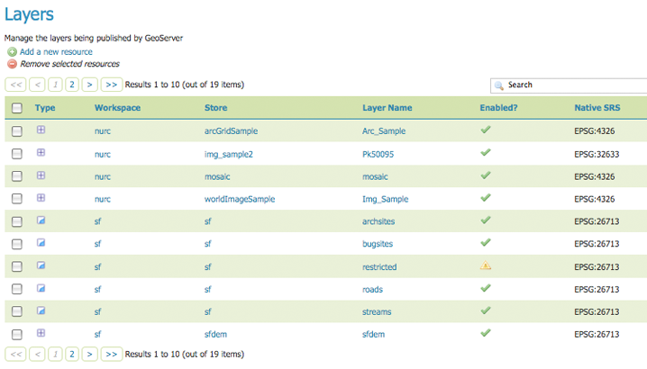

   *Layers View*

**Layer types**

Layers can be divided into two types of data: raster and vector. These two formats differ in how they store spatial information. Vector types store information about feature types as mathematical paths—a point as a single x,y coordinate, lines as a series of x,y coordinates, and polygons as a series of x,y coordinates that start and end on the same place. Raster format data is a cell-based representation of features on the earth surface. Each cell has a distinct value, and all cells with the same value represent a specific feature. 

.. list-table::
   :widths: 5 70 
   :header-rows: 1

   * - Field
     - Description
   * - .. image:: img/data_layers_type1.png
     - raster (grid)
   * - .. image:: img/data_layers_type2.png
     - vector (feature)

**Add a Layer**

At the upper left-hand corner of the layers view page there are two buttons for the adding and removal of layers. The green plus button allows you to add a new layer (referred to as *resource*). The red minus button allows you to remove selected layers. 

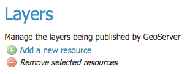
   
   *Buttons to Add and Remove a Layer*

Clicking the :guilabel:`Add a new resource` button brings up a :guilabel:`New Layer Chooser` panel. The menu displays all currently enabled stores. From this menu, select the Store where the layer should be added. 

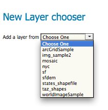

   *List of all currently enabled stores*

Upon selection of a Store, a list is displayed of resources within the store.
Resources which have already been published as layers are listed first, followed by other resources which
are available to be published.
In this example, ``giant_polygon``, ``poi``, ``poly_landmarks`` and ``tiger_roads`` are all existing layers within the NYC store. 

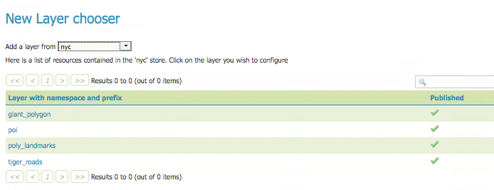
   
   *List of published and available resources in a store*

To add a layer for an available resource click :guilabel:`Publish`.
To add a new layer for a published resource click :guilabel:`Publish Again`. 
(Note that when re-publishing the name of the new layer may have to be modified to avoid conflict with an existing layer.)
The actions display an ``Edit Layer`` page to enter the definition of the new layer.

**Remove a Layer**

To remove a layer, select it by clicking the checkbox next to the layer. As shown below, multiple layers can be selected for batch removal. Note that selections for removal will not persist from one results pages to the next. 
  
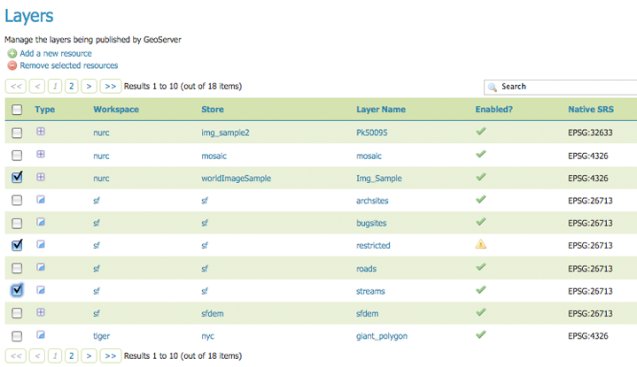
   
   *Some layers selected for removal*

All layers can be selected for removal by clicking the checkbox in the header. 

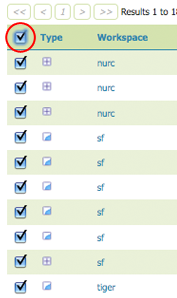
   
   *All layers selected for removal*

Once layer(s) are selected, the :guilabel:`Remove selected resources` link is activated. Once you've clicked the link, you will be asked to confirm or cancel the removal. Selecting :guilabel:`OK` removes the selected layer(s). 
     
.. _webadmin_layers_edit_data:

**Edit Layer: Data**

To view or edit a layer, click the layer name.  A layer configuration page will be displayed. The :guilabel:`Data` tab, activated by default, allows you to define and change data parameters for a layer. 

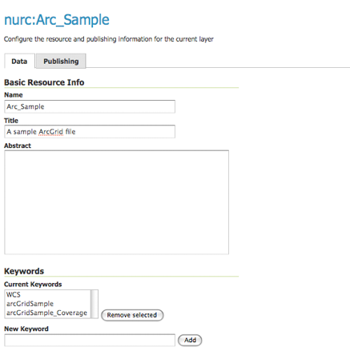
   
   *Edit Layer: Data tab*
   
*Basic Info*

The beginning sections—Basic Resource Info, Keywords and Metadata link—are analogous to the ``Service Metadata`` section for WCS, WFS, and WMS. 
These sections provide "data about the data," specifically textual information that make the layer data easier to understand and work with.
The metadata information will appear in the capabilities documents which refer to the layer.

* **Name**—Identifier used to reference the layer in WMS requests.  (Note that for a new layer for an already-published resource, the name must be changed to avoid conflict.)
* **Title**—Human-readable description to briefly identify the layer to clients (required)   
* **Abstract**—Describes the layer in detail
* **Keywords**—List of short words associated with the layer to assist catalog searching
* **Metadata Links**—Allows linking to external documents that describe the data layer. Currently only two standard format types are valid: TC211 and FGDC. TC211 refers to the metadata structure established by the `ISO Technical Committee for Geographic Information/Geomatics <http://www.isotc211.org/>`_ (ISO/TC 211) while FGDC refers to those set out by the `Federal Geographic Data Committee <http://www.fgdc.gov/>`_ (FGDC) of the United States. 

  .. figure:: img/data_layers_meta.png

     *Adding a metadata link in FGDC format*
   
*Coordinate Reference Systems*

A coordinate reference system (CRS) defines how georeferenced spatial data relates to real locations on the Earth’s surface. CRSes are part of a more general model called Spatial Reference Systems (SRS), which includes referencing by coordinates and geographic identifiers. GeoServer needs to know the Coordinate Reference System of your data. This information is used for computing the latitude/longitude bounding box and reprojecting the data during both WMS and WFS requests.

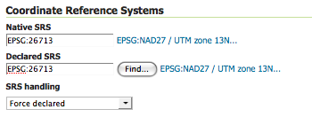
   
   *Coordinate reference system of a layer*  

* **Native SRS**—Specifies the coordinate system the layer is stored in. Clicking the projection link displays a description of the SRS.
* **Declared SRS**—Specifies the coordinate system GeoServer publishes to clients 
* **SRS Handling**—Determines how GeoServer should handle projection when the two SRSes differ 

*Bounding Boxes*

The bounding box determines the extent of the data within a layer. 

* **Native Bounding Box**—The bounds of the data specified in the Native SRS. These bounds can be generated by clicking the :guilabel:`Compute from data` button. 
* **Lat/Lon Bounding Box**—The bounds specified in geographic coordinates. These bounds can be calculated by clicking the :guilabel:`Compute from native bounds` button.

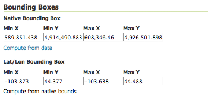
   
   *Bounding Boxes of a layer*

*Feature Type Details (Vector)*

Vector layers have a list of the :guilabel:`Feature Type Details`. These include the :guilabel:`Property` and :guilabel:`Type` of a data source. For example, the ``sf:archsites`` layer shown below includes a geometry (``the_geom``) of type "point". 

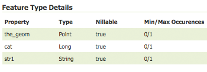

   *Feature Type Details*

The :guilabel:`Nillable` option refers to whether the property requires a value or may be flagged as being null. Meanwhile :guilabel:`Min/Max Occurrences` refers to how many values a field is allowed to have. Currently both :guilabel:`Nillable` and :guilabel:`Min/Max Occurrences` are set to ``true`` and ``0/1`` but may be extended with future work on complex features.

**Edit Layer: Publishing**

The Publishing tab configures HTTP and WMS/WFS/WCS settings.

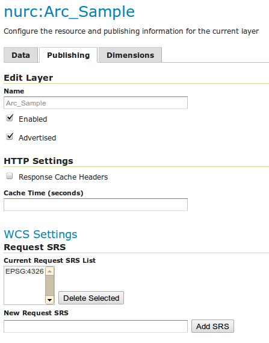
   
   *Edit Layer: Publishing tab*
   
* **Enabled**—A layer that is not enabled won't be available to any kind of request, it will just show up in the configuration (and in REST config)
* **Advertised**—A layer is advertised by default. A non-advertised layer will be available in all data access requests (for example, WMS GetMap, WMS GetFeature) but won't appear in any capabilities document or in the layer preview. 

*HTTP Settings*

Cache parameters that apply to the HTTP response from client requests.

* **Response Cache Headers**— If selected, GeoServer will not request the same tile twice within the time specified in :guilabel:`Cache Time`. One hour measured in seconds (3600), is the default value for :guilabel:`Cache Time`.

*WMS Settings*

Sets the WMS specific publishing parameters.

  .. figure:: img/wms_settings.png

     *WMS Settings*

* **Queryable**—Controls whether the layer is queryable via WMS ``GetFeatureInfo`` requests.
* **Default style**—Style that will be used when the client does not specify a named style in GetMap requests.
* **Additional styles**—Other styles that can be associated with this layer. Some clients (and the GeoServer Layer Preview) will present those as styling alternatives for that layer to the user.
* **Default rendering buffer**—Default value of the ``buffer`` GetMap/GetFeatureInfo vendor parameter. See the `Wms Vendor Parameters <http://docs.geoserver.org/stable/en/user/services/wms/vendor.html#wms-vendor-parameters>`_ for more details.
* **Default WMS path**—Location of the layer in the WMS capabilities layer tree. Useful for building non-opaque layer groups

*WMS Attribution*

Sets publishing information about data providers.

  .. figure:: img/data_layers_WMS.png
   
     *WMS Attribution*

* **Attribution Text**—Human-readable text describing the data provider. This might be used as the text for a hyperlink to the data provider's web site.
* **Attribution Link**—URL to the data provider's website.
* **Logo URL**—URL to an image that serves as a logo for the data provider.
* **Logo Content Type, Width, and Height**—These fields provide information about the logo image that clients may use to assist with layout. GeoServer will auto-detect these values if you click the :guilabel:`Auto-detect image size and type` link at the bottom of the section. The text, link, and URL are each advertised in the WMS Capabilities document if they are provided. Some WMS clients will display this information to advise users which providers provide a particular dataset. If you omit some of the fields, those that are provided will be published and those that are not will be omitted from the Capabilities document.

*WFS Settings*

* **Per-Request Feature Limit**—Sets the maximum number of features for a layer a WFS GetFeature operation should generate (regardless of the actual number of query hits)
* **Maximum number of decimals**—Sets the maximum number of decimals in GML output.

  .. note::

     It is also possible to override the ``OtherSRS/OtherCRS`` list configured in the WFS service, including overriding it with an empty list if need be. The input area will accept a comma separated list of EPSG codes:

     .. figure:: img/data_layers_WFS.png

        *WFS otherSRS/otherCRS override*

     The list will be used only for the capabilities document generation, but will not be used to limit the actual target SRS usage in GetFeature requests.

How GeoNode Automatically Configures Layers
^^^^^^^^^^^^^^^^^^^^^^^^^^^^^^^^^^^^^^^^^^^
GeoNode automatically sets and updates information on GeoServer every time a Layer is created or its metadata updated.

**Excercise**

*Verify Information On GeoServer Side*

1. Log inot GeoNode as ``Administrator``. Then click on the user button on the top right.

   .. figure:: img/layer_styles_008.jpg

      *GeoNode Admin*

2. From the menu, click on the ``GeoServer`` voice.

   .. figure:: img/layer_styles_009.jpg

      *GeoNode Admin GeoServer*

3. You will be redirected to the ``GeoServer`` admin interface.

   .. figure:: img/layer_styles_010.jpg

      *GeoServer Admin Gui*

4. Select the ``Layers`` topic from the left menu.

   .. figure:: img/geonode_layers_menu.jpg

      *GeoServer Layers Menu*

5. Select the Layer ``san_andres_y_providencia_coastline`` from the list.

   .. figure:: img/geonode_layers_list.jpg

      *GeoServer Layers List*

6. Notice how the **Basic Resource Info** have been automatically configured by GeoNode.

   - The **Name** reflects the original file name.
   - The **Title** has been filled with the Metadata value
   - The **Abstract** has been filled with the Metadata value
   - The **Keywords** have been added with the Metadata values
   
   
   .. figure:: img/geonode_layers_basic_data.jpg

      *GeoServer Layers Basic Resource Info*

7. Notice how the **Metadata Links** reflect the Metadada Download options available on GeoNode, along with the URLs.

   .. figure:: img/geonode_layers_metadata_links.jpg

      *GeoServer Layers Metadata Links*

8. Notice how the **Coordinate Reference System** and the **Bounding Boxes** have been automatically filled by GeoNode accordingly with the data source info.

   .. figure:: img/geonode_layers_crs.jpg

      *GeoServer Layers Coordinate Reference System*

9. On the **Publishing Section** the **Default Style** has been updated and configured by GeoNode.

   .. figure:: img/geonode_layers_styles.jpg

      *GeoServer Layers Publishing Section*
      
GeoServer Stylesheets (SLD)
^^^^^^^^^^^^^^^^^^^^^^^^^^^
Styles render, or make available, geospatial data. Styles for GeoServer are written in Styled Layer Descriptor (SLD), a subset of XML. 
Please see the section on `Styling <http://docs.geoserver.org/stable/en/user/styling/index.html#styling>`_ for more information on working with styles. 

On the Styles page, you can add a new style, view or edit an existing style, or remove a style.

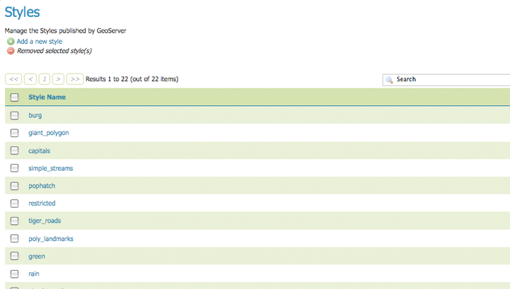
   
   *Styles page*

**Edit a Style**

To view or edit a style, click the style name. A :guilabel:`Style Editor` page will be diplayed.  
The page presents options for configuring a style's name, code, and other attributes. Style names are specified at the top in the name field. 
The style's workspace can be chosen using workspace selector. Styles are edited using a plain text editor with some basic utilities.

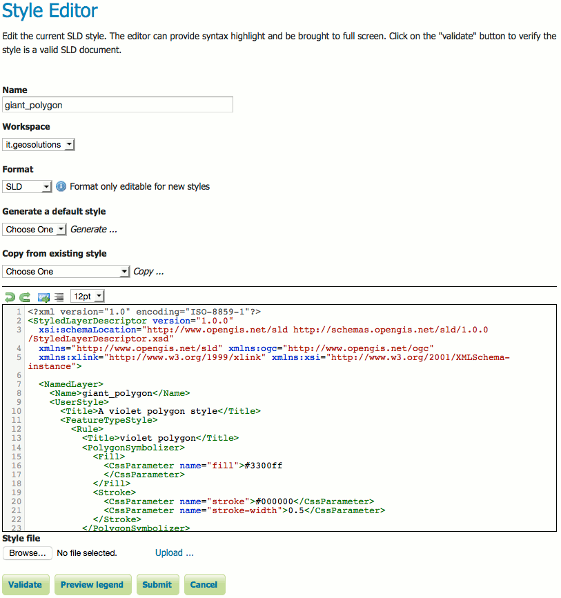
   
   *Style editor*
   
The style editor supports line numbering, automatic indentation, and real-time syntax highlighting. You can also increase or decrease the font size of the editor.

.. list-table::
   :widths: 25 75 

   * - **Button**
     - **Description**

   * - .. image:: img/data_style_editor_undo.png
     - undo
   * - .. image:: img/data_style_editor_redo.png
     - redo
   * - .. image:: img/data_style_editor_goto.png
     - go to line
   * - .. image:: img/data_style_editor_reformat.png
     - auto-format the editor contents
   * - .. image:: img/data_style_editor_fontsize.png
     - change the font size of the editor

To confirm that the SLD code is fully compliant with the SLD schema, click the :guilabel:`Validate` button. A message box will confirm whether the style contains validation errors.

.. note:: GeoServer will sometimes render styles that fail validation, but this is not recommended. 

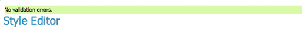
   
   *No validation errors* 
   
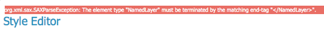
   
   *Validation error message* 

To view the `generated legend entry <http://docs.geoserver.org/stable/en/user/advanced/wmsdecoration.html#decoration-types>`_ for the style, click the :guilabel:`Preview Legend` button.

**Add a Style**

The buttons for adding and removing a style can be found at the top of the :guilabel:`Styles` page. 

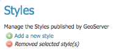

   *Adding or removing a style*
   
To add a new style, select the :guilabel:`Add a new style` button. You will be redirected to an editor page. Enter a name for the style. 
You can also select the style format. In a default GeoServer installation only SLD is supported, but other extensions (such as `css <http://docs.geoserver.org/stable/en/user/extensions/css/index.html#extensions-css>`_) add support for 
additional formats. The editor page provides several options for submitting a new style. You can paste the style directly into the editor contents. You can generate a new default style based on an internal template:

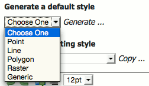

   *Generating a new default style.*

You can copy the contents of an existing style into the editor:

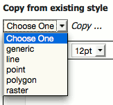

   *Copying an existing Style from GeoServer*

You can select and upload a local file that contains the SLD:

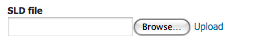

   *Uploading an SLD file from your local computer*
   
Once a style is successfully submitted, you will be redirected to the main :guilabel:`Styles` page where the new style will be listed.

**Remove a Style**

To remove a style, select it by clicking the checkbox next to the style. Multiple styles can be selected, or all can be selected by clicking the checkbox in the header. 
Click the :guilabel:`Remove selected style(s)` link at the top of the page. You will be asked to confirm or cancel the removal. Clicking :guilabel:`OK` removes the selected style(s). 
 
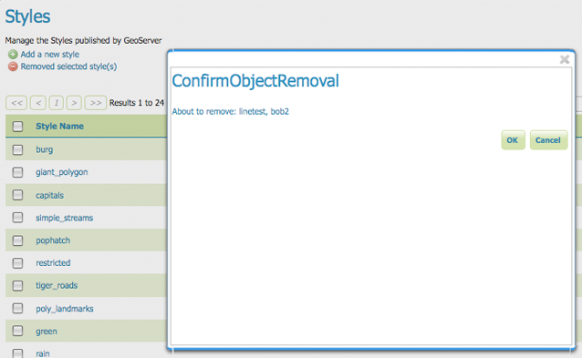
   
   *Confirmation prompt for removing styles*

How GeoNode Automatically Configures Style
^^^^^^^^^^^^^^^^^^^^^^^^^^^^^^^^^^^^^^^^^^
Whe uploading a new Layer to GeoNode, it creates by default an SLD on GeoServer with the **same native name of the Layer** and assigns it to the Layer ad **Default Style**.

In the previous sections you already modified the default style of the Layer ``san_andres_y_providencia_coastline`` automatically generated by GeoNode.

GeoServer Data Dir Structure
^^^^^^^^^^^^^^^^^^^^^^^^^^^^
This section gives an overview of the structure and contents of the GeoServer data directory. 

This is not intended to be a complete reference to the GeoServer configuration information, 
since generally the data directory configuration files should not be accessed directly.
Instead, the `Web Administration Interface <http://docs.geoserver.org/stable/en/user/webadmin/index.html#web-admin>`_ can be used to view and modify the configuration manually, 
and for programmatic access and manipulation 
the `REST configuration <http://docs.geoserver.org/stable/en/user/rest/index.html#rest>`_ API should be used.

The directories that do contain user-modifiable content are:
``logs``, ``palettes``, ``templates``, ``user-projection``, and ``www``.

The following figure shows the structure of the GeoServer data directory:

   .. code-block:: console
      :linenos:
      
       <data_directory>/
       
          global.xml
          logging.xml
          wms.xml
          wfs.xml
          wcs.xml
          
          data/
          demo/
          geosearch/
          gwc/
          layergroups/
          logs/
          palettes/
          plugIns/
          security/
          styles/
          templates/
          user_projections/
          workspaces/
            |
            +- workspace dirs...
               |
               +- datastore dirs...
                  |
                  +- layer dirs...
          www/

**The .xml files**

The top-level ``.xml`` files contain information about the services and various global options for the server instance. 

.. list-table::
   :widths: 20 80

   * - **File**
     - **Description**
   * - ``global.xml``
     - Contains settings common to all services, such as contact information, JAI settings, character sets and verbosity.
   * - ``logging.xml``
     - Specifies logging parameters, such as logging level, logfile location, and whether to log to stdout.  
   * - ``wcs.xml`` 
     - Contains the service metadata and various settings for the WCS service.
   * - ``wfs.xml`` 
     - Contains the service metadata and various settings for the WFS service.
   * - ``wms.xml`` 
     - Contains the service metadata and various settings for the WMS service.

**workspaces**

The ``workspaces`` directory contain metadata about the layers published by GeoServer.
It contains a directory for each defined **workspace**.
Each workspace directory contains directories for the **datastores** defined in it.
Each datastore directory contains directories for the **layers** defined for the datastore.
Each layer directory contains a ``layer.xml`` file, and 
either a ``coverage.xml`` or a ``featuretype.xml`` file 
depending on whether the layer represents a *raster* or *vector* dataset.

**data**

The ``data`` directory can be used to store file-based geospatial datasets being served as layers.
(This should not be confused with the main "GeoServer data directory".)
This directory is commonly used to store shapefiles and raster files, 
but can be used for any data that is file-based.

The main benefit of storing data files under the ``data`` directory is portability. 
Consider a shapefile stored external to the data directory at a location ``C:\gis_data\foo.shp``. 
The ``datastore`` entry in ``catalog.xml`` for this shapefile would look like the following:

   .. code-block:: xml
      :linenos:
      
       <datastore id="foo_shapefile">
          <connectionParams>
            <parameter name="url" value="file://C:/gis_data/foo.shp" />
          </connectionParams>
        </datastore>

Now consider trying to port this data directory to another host running GeoServer. 
The location ``C:\gis_data\foo.shp`` probably does not exist on the second host. 
So either the file must be copied to this location on the new host, 
or ``catalog.xml`` must be changed to reflect a new location.

This problem can be avoided by storing ``foo.shp`` in the ``data`` directory. 
In this case the ``datastore`` entry in ``catalog.xml`` becomes:

   .. code-block:: xml
      :linenos:
      
        <datastore id="foo_shapefile">
          <connectionParams>
            <parameter name="url" value="file:data/foo.shp"/>
          </connectionParams>
        </datastore>

The ``value`` attribute is rewritten to be relative to the ``data`` directory. 
This location independence allows the entire data directory to be copied to a new host 
and used directly with no additional changes.

**demo**

The ``demo`` directory contains files which define the *sample requests* available in the *Sample Request Tool* (http://localhost/geoserver/demoRequest.do). 
See the `Demos <http://docs.geoserver.org/stable/en/user/webadmin/demos/index.html#webadmin-demos>`_ page for more information.

**geosearch**

The ``geosearch`` directory contains information for regionation of KML files.

**gwc**

The ``gwc`` directory holds the cache created by the embedded GeoWebCache service.

**layergroups**

The ``layergroups`` directory contains configuration information for the defined layergroups.

**logs**

The ``logs`` directory contains configuration information for logging profiles, 
and the default ``geoserver.log`` log file.
See also `Advanced log configuration <http://docs.geoserver.org/stable/en/user/advanced/logging.html#logging>`_.

**palettes**

The ``palettes`` directory is used to store pre-computed **Image Palettes**. 
Image palettes are used by the GeoServer WMS as way to reduce the size of produced images while maintaining image quality.
See also `Paletted Images <http://docs.geoserver.org/stable/en/user/tutorials/palettedimage/palettedimage.html#tutorials-palettedimages>`_.

**security**

The ``security`` directory contains the files used to configure the GeoServer security subsystem. This includes a set of property files which define *access roles*, along with the services and data each role is authorized to access. See the `Security <http://docs.geoserver.org/stable/en/user/security/index.html#security>`_ section for more information.

**styles**

The ``styles`` directory contains Styled Layer Descriptor (SLD) files which contain styling information used by the GeoServer WMS. For each file in this directory there is a corresponding entry in ``catalog.xml``:

   .. code-block:: xml
      :linenos:
      
        <style id="point_style" file="default_point.sld"/>

See the `Styling <http://docs.geoserver.org/stable/en/user/styling/index.html#styling>`_ section for more information about styling and SLD .

**templates**

The ``templates`` directory contains files used by the GeoServer **templating** subsystem. 
Templates are used to customize the output of various GeoServer operations.
See also `Freemarker Templates <http://docs.geoserver.org/stable/en/user/tutorials/freemarker.html#tutorial-freemarkertemplate>`_.

**user_projections**

The ``user_projections`` directory contains a file called ``epsg.properties`` which is used to define custom spatial reference systems that are not part of the official `EPSG database <http://www.epsg.org/CurrentDB.html>`_.
See also `Custom CRS Definitions <http://docs.geoserver.org/stable/en/user/advanced/crshandling/customcrs.html#crs-custom>`_.

**www**

The ``www`` directory is used to allow GeoServer to serve files like a regular web server. 
The contents of this directory are served at ``http:/<host:port>/geoserver/www``.
While not a replacement for a full blown web server, 
this can be useful for serving client-side mapping applications.
See also `Serving Static Files <http://docs.geoserver.org/stable/en/user/tutorials/staticfiles.html#tutorials-staticfiles>`_.

**Excercise**

*Navigate the GeoServer Data Directory*

1. Log inot GeoNode as ``Administrator``. Then click on the user button on the top right.

   .. figure:: img/layer_styles_008.jpg

      *GeoNode Admin*

2. From the menu, click on the ``GeoServer`` voice.

   .. figure:: img/layer_styles_009.jpg

      *GeoNode Admin GeoServer*

3. You will be redirected to the ``GeoServer`` admin interface.

   .. figure:: img/layer_styles_010.jpg

      *GeoServer Admin Gui*

4. Select the ``Server Status`` topic from the left menu. On the status page note the ``Data Directory``.

   .. figure:: img/layer_gs_datadir_001.jpg

      *GeoServer Admin Server Status Page*

5. Open a ``Terminal`` window and go to the GeoServer Data Directory folder. Navigate the folders and examine the files.

6. Enter the ``styles`` directory and confirm it is present the file ``san_andres_y_providencia_coastline.sld``

   .. code-block:: console
      :linenos:

      $ cat san_andres_y_providencia_coastline.sld

Steps To Manually Migrate A Layer
---------------------------------
TODO

1. Download a Layer as ESRI Shapefile
^^^^^^^^^^^^^^^^^^^^^^^^^^^^^^^^^^^^^
TODO

2. Save and exrpot the Layer SLDs
^^^^^^^^^^^^^^^^^^^^^^^^^^^^^^^^^
TODO

3. Import back the Layer through the "importlayers" GeoNode Management Command
^^^^^^^^^^^^^^^^^^^^^^^^^^^^^^^^^^^^^^^^^^^^^^^^^^^^^^^^^^^^^^^^^^^^^^^^^^^^^^
TODO

Final Checks And Hints
----------------------
TODO

